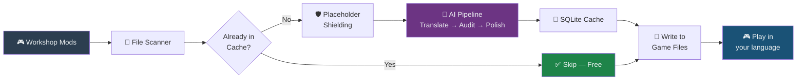
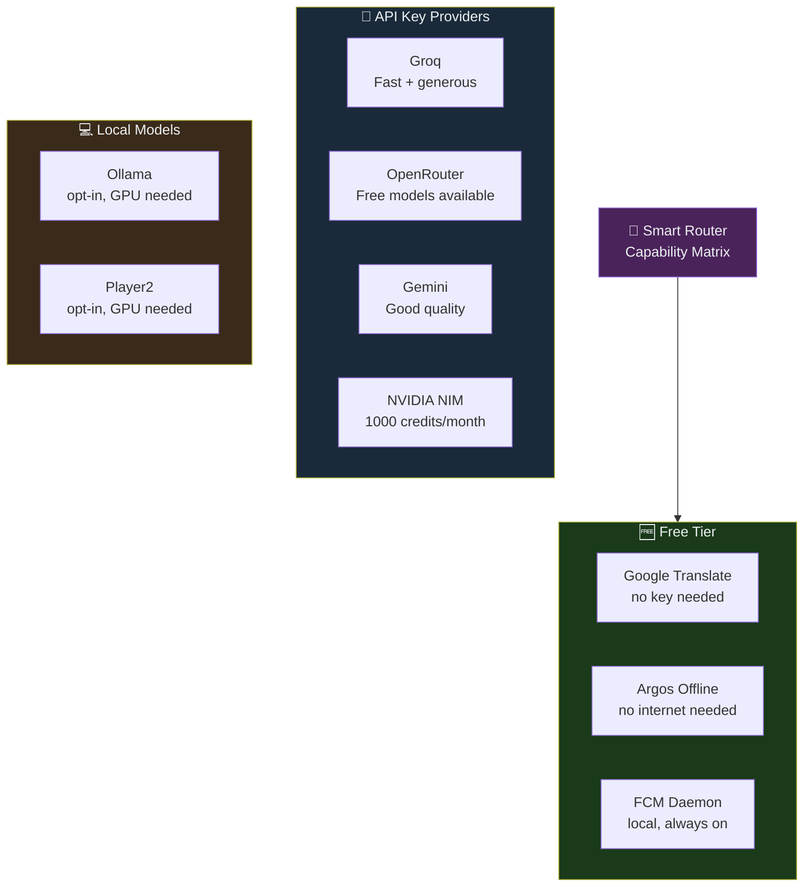
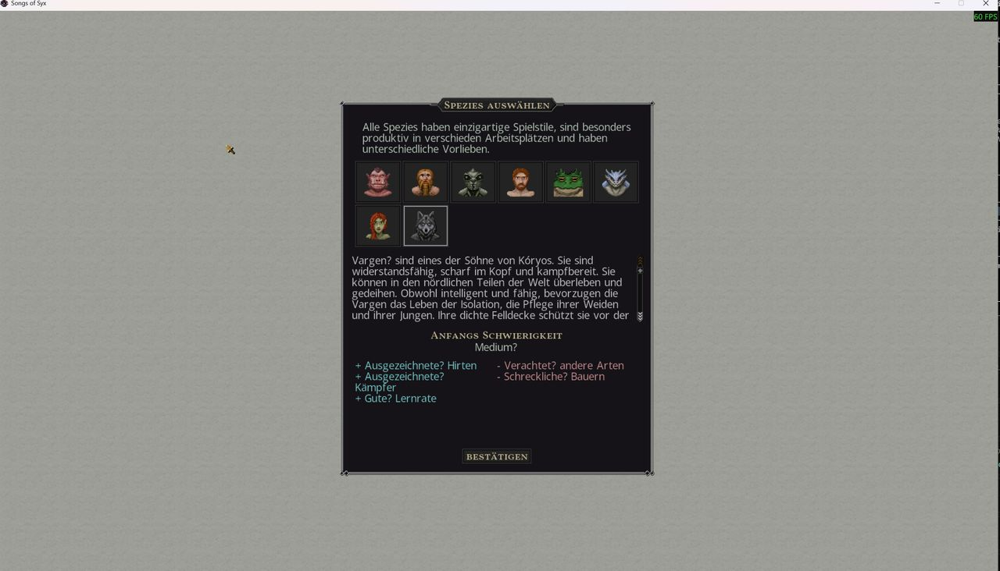
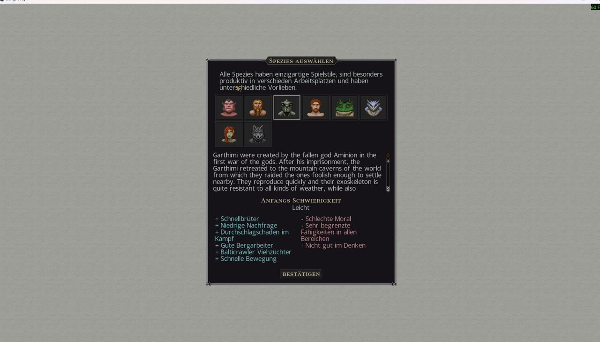
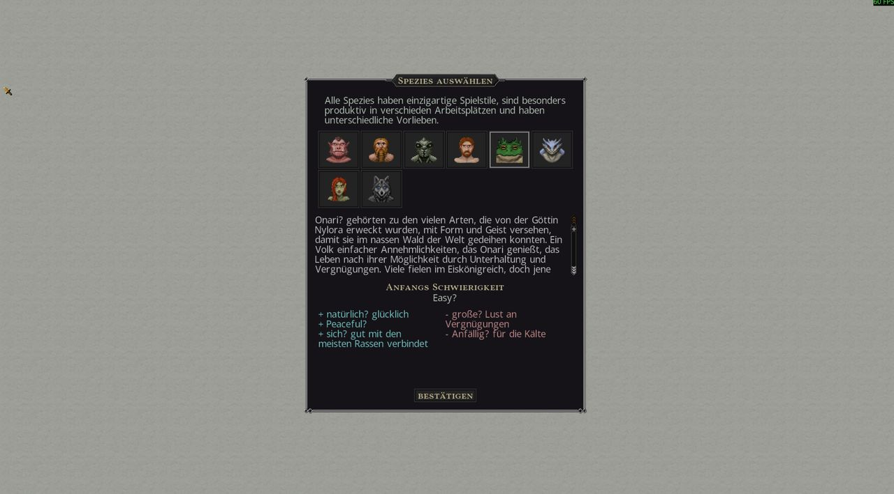
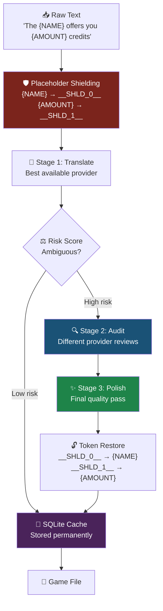
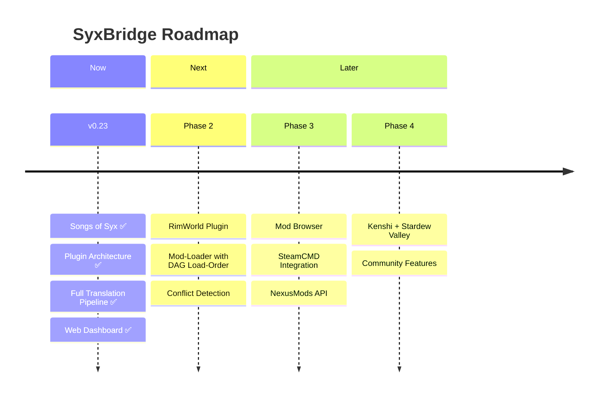
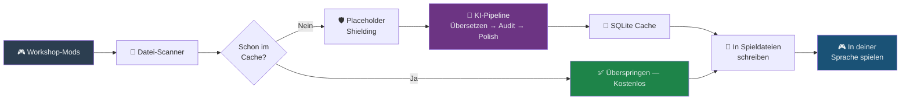
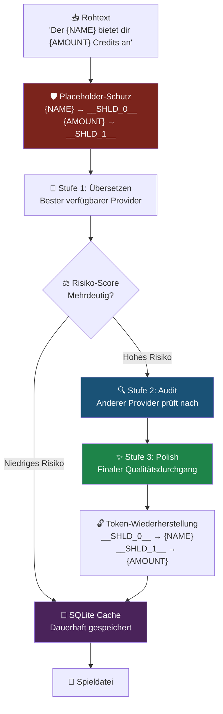

# SyxBridge — KI-Übersetzung für Spiel-Mods

<p align="center">
  
</p>

<p align="center">
  <a href="#-english"></a>
  <a href="#-deutsch"></a>
  
  
  
  
  
  
</p>

<p align="center">
  <strong>Aus Versehen gebaut. Läuft mit Absicht.</strong><br>
  <em>„Ich wollte nur meine Mods auf Deutsch spielen. Jetzt hab ich eine KI-Pipeline mit Web-Dashboard, Key-Rotation, Capability-Matrix und Stresstest-System. Irgendwas ist schiefgelaufen."</em>
</p>

---

## 🇬🇧 English

<details open>
<summary><h3>🎮 Real Use Cases — Why does this exist?</h3></summary>

**Scenario 1: You have 50 mods. They're all in English.**

You could read English fine. But your wife doesn't. Your kid doesn't. Your buddy who gifted you the game doesn't. You want to play together — but the entire game is locked behind a language barrier.

You double-click `start.bat`. Get a coffee. Come back in 20 minutes. Your mods are in German (or French, or Japanese, or whatever you set). Every species screen, every trait, every piece of lore — done.

**Scenario 2: You released a mod. Players want it translated.**

You built something cool. 500 subscribers. Half of them are not English-native. You run SyxBridge in Patch Mode — it generates a separate translation mod you can upload directly to the Steam Workshop. One command. Your players get their language, your original mod stays untouched.

**Scenario 3: You want quality, not slop.**

Google Translate would mangle "Hive Queen" into something unrecognizable on page 47. SyxBridge remembers. It builds a glossary. It shields game-specific terms through every AI call. It audits its own output. It polishes the result. "Hive Queen" stays "Hive Queen" — consistently, across all 3,000+ strings.

</details>

---

### ⚡ How it actually works



**The short version:** Scan → Shield → Translate → Audit → Polish → Cache → Write. First run does the work. Every run after that is just cache hits. API cost after the first sweep? Near zero.

---

### 🤖 9 AI Providers — Pick your poison



Each provider has a **Capability Matrix** — it knows whether it can translate, audit, or polish. No accidents. The router picks the best available provider for each stage. If one goes down, the next takes over. Automatic key rotation on rate limits. 30–60s cooldown. Your keys outlive my sleep schedule.

---

### 📸 Dashboard — What you're actually looking at

<table>
<tr>
<td align="center" width="50%">

**Idle Mode · DB Browser**

*Browse your 3,200+ cached translations. Edit entries. Check provider health. See what's cached.*

</td>
<td align="center" width="50%">

**Run Mode · Live Terminal**

*Watch the AI work in real time. Live prompts, responses, progress bars. No black box.*

</td>
</tr>
</table>

### 🎮 In-Game — It actually works

<table>
<tr>
<td align="center" width="33%">


*Vargen — full species screen, DE*

</td>
<td align="center" width="33%">


*Garthimi — partial (not yet cached)*

</td>
<td align="center" width="33%">


*Onari — traits + UI, smooth.*

</td>
</tr>
</table>

> Mixed results on the middle screenshot are *expected and intentional* — that mod wasn't in the DB yet. One more run, it's done. That's how the cache works.

---

### 🛠️ Quickstart — Actually 4 Steps

```bash
# 1. Install Node.js (v18+)
#    → https://nodejs.org/

# 2. Clone
git clone https://github.com/vannon091118/Syx_bridge-
cd Syx_bridge-

# 3. API Keys (optional — works without them)
#    Copy .env.example → .env, add at least one key
#    Or skip this entirely and use Google Translate Free

# 4. Launch
start.bat
```

The `.bat` does everything: installs dependencies, creates the `.env` template, starts the server, opens `localhost:3000`. Add keys under **⚙️ → Manage API Keys**, hit **Apply Changes**. Done. Go make coffee.

---

### 🔑 Keys — What's Free, What Costs Money

| Provider | Where to get | Free Tier | Notes |
|---|---|---|---|
| **Google Translate Free** | Built-in | ✅ Always free | Lower quality, no key needed |
| **Argos Translate** | Built-in | ✅ Offline | GPU not required, decent quality |
| **Groq** | [console.groq.com](https://console.groq.com) | ✅ Generous daily limit | Fast. Very fast. |
| **OpenRouter** | [openrouter.ai/keys](https://openrouter.ai/keys) | ✅ Free models available | Flexible routing |
| **Gemini** | [aistudio.google.com](https://aistudio.google.com) | ✅ Free tier | Good quality |
| **NVIDIA NIM** | [build.nvidia.com](https://build.nvidia.com) | ✅ 1000 credits/month | High quality |
| **FCM** | Local daemon | ✅ Always free | No key, no internet |

> **Keys stay local.** They live in `.env`. `.env` is in `.gitignore`. They never leave your machine except to hit the provider's own API endpoint. If you fork this — check your `.gitignore` before you do anything else.

---

### 🛡️ The Quality Stack — Why it's not just Google Translate



The glossary layer runs on top of all of this — it remembers "Hive Queen" from the first time it sees it and enforces it everywhere. 3,200+ entries cached. 0 watermarks.

---

### 📊 Modes — Native vs. Patch

| | **Native Mode** | **Patch Mode** |
|---|---|---|
| **What it does** | Writes translations directly into your installed mod files | Creates a separate mod folder alongside the original |
| **Original files** | Automatically backed up before first overwrite | Completely untouched |
| **Use case** | Personal play — you want everything in your language | Modders — you want to publish a translation to Steam Workshop |
| **Default** | ✅ On | Off (opt-in via `.env`) |

---

### ⚠️ Honest Status — Alpha, In Daily Use

| | |
|---|---|
| **Version** | v0.23.0 (active development) |
| **Maturity** | Alpha · Solo project · I play on it every day |
| **DB** | ~3,288 translated entries · 0 watermarks |
| **Tests** | 111 PASS · 0 FAIL (`npm test`) |
| **Runtime Score** | 90.1% — probability it runs on your machine without intervention |
| **"Untested" tags** | Every release gets `-untested` until confirmed on a non-dev machine |

The `-untested` tag is honest labeling, not a warning to stay away. It means: works perfectly for me, not yet confirmed by someone else on a different machine. That's it.

<details>
<summary><b>Known Issues (4 open)</b></summary>

| ID | Issue | Severity |
|---|---|---|
| BU-004 | Backup race condition on parallel file writes | 🟡 P2 |
| BU-019 | `consecutiveGrammarFailures` module-scoped mutable state (theoretical) | 🟡 P2 |
| BU-025 | Vendor-sync drift: bidirectional sync not implemented | 🟡 P2 |
| BU-026 | No CI test framework (manual `check()` pattern) | 🟢 P3 |

</details>

---

### 🗺️ Where this is going



The plugin architecture is already there. Adding a new game is 1 file (~200-400 lines). RimWorld's format hooks are already stubbed in. The translation pipeline is game-agnostic by design.

---

### 📧 Contact & Bug Reports

**Email:** [vannon858@gmail.com](mailto:vannon858@gmail.com)

When filing a bug, please include:
- `log.txt` + `debug_payloads.txt` (both in the `core/` directory)
- Your `.env` — **without keys**, mask them: `GROQ_KEY_1=sk-***masked***`

---

</details>

---

## 🇩🇪 Deutsch

<details>
<summary><h3>🎮 Use Cases — Warum existiert das hier?</h3></summary>

**Szenario 1: Du hast 50 Mods. Alle auf Englisch.**

Du könntest Englisch notfalls lesen. Aber deine Frau nicht. Dein Kind nicht. Der Kumpel, der dir das Spiel geschenkt hat, auch nicht. Ihr wollt zusammen spielen — aber das komplette Spiel steckt hinter einer Sprachbarriere.

Du machst einen Doppelklick auf `start.bat`. Holst dir einen Kaffee. Kommst in 20 Minuten wieder. Deine Mods sind auf Deutsch. Jeder Speziesscreen, jedes Trait, jede Lore-Zeile — erledigt.

**Szenario 2: Du hast einen Mod veröffentlicht. Die Spieler wollen ihn übersetzt.**

Du hast was Cooles gebaut. 500 Abonnenten. Die Hälfte davon ist kein Muttersprachler. Du läufst SyxBridge im Patch-Mode — er generiert einen separaten Übersetzungsmod, den du direkt in den Steam Workshop hochladen kannst. Ein Befehl. Deine Spieler kriegen ihre Sprache, dein Original-Mod bleibt unangetastet.

**Szenario 3: Du willst Qualität, kein Matsch.**

Google Translate hätte „Hive Queen" auf Seite 47 in was Unkenntliches verwandelt. SyxBridge erinnert sich. Es baut ein Glossar. Es schützt spielspezifische Begriffe durch jeden KI-Aufruf. Es prüft seine eigene Ausgabe. Es poliert das Ergebnis nach. „Schwarm-Königin" bleibt „Schwarm-Königin" — konsistent über alle 3.000+ Strings.

</details>

---

### ⚡ Wie es wirklich funktioniert



**Die Kurzfassung:** Scannen → Schützen → Übersetzen → Prüfen → Polieren → Cachen → Schreiben. Der erste Lauf macht die Arbeit. Jeder Lauf danach ist nur Cache-Hits. API-Kosten nach dem ersten Durchlauf? Nahezu null.

---

### 🛡️ Warum das nicht einfach Google Translate ist



---

### 📸 Dashboard

<table>
<tr>
<td align="center" width="50%">

**Idle-Modus · DB-Browser**

*Deine 3.200+ gecachten Übersetzungen. Einträge bearbeiten. Provider-Status einsehen.*

</td>
<td align="center" width="50%">

**Run-Modus · Live-Terminal**

*Die KI live bei der Arbeit zusehen. Keine Blackbox.*

</td>
</tr>
</table>

### 🎮 Im Spiel — Es funktioniert tatsächlich

<table>
<tr>
<td align="center" width="33%">


*Vargen — komplett übersetzt*

</td>
<td align="center" width="33%">


*Garthimi — Teilübersetzung (noch nicht gecacht)*

</td>
<td align="center" width="33%">


*Onari — UI + Traits, sauber.*

</td>
</tr>
</table>

> Das mittlere Screenshot zeigt *erwartetes Verhalten* — der Mod war noch nicht in der DB. Noch ein Lauf, erledigt. So funktioniert der Cache.

---

### 🛠️ Start — 4 Schritte

```bash
# 1. Node.js installieren (v18+)
#    → https://nodejs.org/

# 2. Klonen
git clone https://github.com/vannon091118/Syx_bridge-
cd Syx_bridge-

# 3. API-Keys eintragen (optional — funktioniert auch ohne)
#    .env.example → .env kopieren, mindestens einen Key eintragen
#    Oder überspringen und Google Translate Free nutzen

# 4. Starten
start.bat
```

Die `.bat` erledigt alles: Dependencies installieren, `.env`-Vorlage erstellen, Server starten, `localhost:3000` öffnen. Keys unter **⚙️ → Manage API Keys** eintragen, **Apply Changes** drücken. Fertig. Kaffee holen.

---

### 🔑 Keys — Was ist kostenlos, was kostet was

| Provider | Woher | Kostenlos | Anmerkung |
|---|---|---|---|
| **Google Translate Free** | Eingebaut | ✅ Immer kostenlos | Niedrigere Qualität, kein Key nötig |
| **Argos Translate** | Eingebaut | ✅ Offline | Kein GPU nötig, solide Qualität |
| **Groq** | [console.groq.com](https://console.groq.com) | ✅ Großzügiges Tageslimit | Schnell. Sehr schnell. |
| **OpenRouter** | [openrouter.ai/keys](https://openrouter.ai/keys) | ✅ Kostenlose Modelle | Flexibles Routing |
| **Gemini** | [aistudio.google.com](https://aistudio.google.com) | ✅ Free-Tier | Gute Qualität |
| **NVIDIA NIM** | [build.nvidia.com](https://build.nvidia.com) | ✅ 1000 Credits/Monat | Hohe Qualität |
| **FCM** | Lokaler Daemon | ✅ Immer kostenlos | Kein Key, kein Internet |

> **Keys bleiben lokal.** Sie leben in `.env`. `.env` ist in `.gitignore`. Sie verlassen deinen Rechner nur um den Provider-Endpunkt zu treffen. Beim Fork: `.gitignore` als Erstes prüfen.

---

### 📊 Modi — Native vs. Patch

| | **Native Mode** | **Patch Mode** |
|---|---|---|
| **Was passiert** | Übersetzungen direkt in installierte Mod-Dateien schreiben | Separaten Mod-Ordner neben dem Original erstellen |
| **Original-Dateien** | Automatisch gesichert vor dem ersten Überschreiben | Komplett unberührt |
| **Use Case** | Persönliches Spielen — alles in deiner Sprache | Modder — du willst einen Übersetzungspatch im Workshop veröffentlichen |
| **Standard** | ✅ An | Aus (Opt-in via `.env`) |

---

### ⚠️ Ehrlicher Status — Alpha, im täglichen Betrieb

| | |
|---|---|
| **Version** | v0.23.0 (aktive Entwicklung) |
| **Reifegrad** | Alpha · Solo-Projekt · ich spiele täglich damit |
| **DB** | ~3.288 übersetzte Einträge · 0 Watermarks |
| **Tests** | 111 PASS · 0 FAIL (`npm test`) |
| **Runtime Score** | 90,1% — Wahrscheinlichkeit, dass es auf deinem System läuft |
| **„Untested"-Tags** | Jedes Release bekommt `-untested` bis es auf einem Nicht-Dev-Rechner bestätigt wurde |

Das `-untested`-Tag ist ehrliche Beschriftung, kein Warnsignal. Es bedeutet: bei mir läuft es einwandfrei, noch nicht von jemand anderem auf einem anderen Rechner bestätigt. Das ist alles.

<details>
<summary><b>Bekannte Issues (4 offen)</b></summary>

| ID | Fehler | Severity |
|---|---|---|
| BU-004 | Backup Race-Condition bei parallelen File-Writes | 🟡 P2 |
| BU-019 | `consecutiveGrammarFailures` modul-scoped mutable State (theoretisch) | 🟡 P2 |
| BU-025 | Vendor-Sync Drift: bidirektionaler Sync nicht implementiert | 🟡 P2 |
| BU-026 | Kein CI-Test-Framework (manuelles `check()`-Pattern) | 🟢 P3 |

</details>

---

### 📧 Kontakt & Bug-Reports

**Email:** [vannon858@gmail.com](mailto:vannon858@gmail.com)

Bei Bug-Reports bitte mitsenden:
- `log.txt` + `debug_payloads.txt` (beide im `core/`-Verzeichnis)
- `.env` — **ohne Keys**, maskieren: `GROQ_KEY_1=sk-***masked***`

---

</details>

---

<p align="center">
  <em>Kein Scrum-Master wurde bei der Entwicklung dieses Projekts verletzt.</em><br>
  <em>No Scrum Masters were harmed during the development of this project.</em>
</p>

<p align="center">
  <sub>MIT License · © 2026 Vannon · Happy Slaver-Management! 🎮</sub>
</p>
