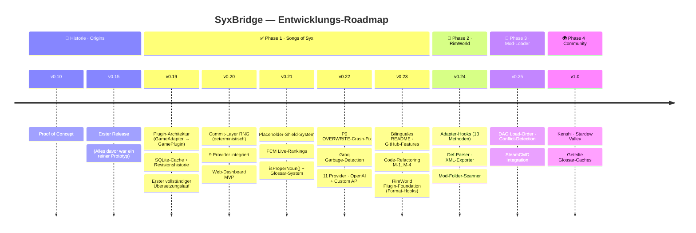
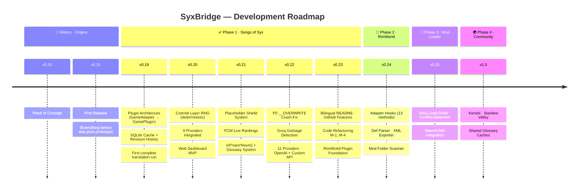

<div align="center">


<br/>

<!-- BADGES — STATUS BOARD -->
<a href="https://github.com/vannon091118/Syx_Bridge-Auto-Translate-Mods/releases"></a>&nbsp;
<a href="#"></a>&nbsp;
<a href="#-quality-metrics--qualit%C3%A4tsmetriken"></a>&nbsp;
<a href="#"></a>&nbsp;
<a href="#"></a>&nbsp;
<a href="LICENSE"></a>

<br/><br/>

<a href="#-quickstart"></a>&nbsp;
<a href="#-the-dashboard--das-dashboard"></a>&nbsp;
<a href="#-roadmap"></a>&nbsp;
<a href="mailto:vannon858@gmail.com"></a>

</div>

---

<div align="center">

> *„Ich wollte nur meine Mods auf Deutsch spielen.*
> *Jetzt hab ich eine KI-Pipeline mit Web-Dashboard, Key-Rotation, Capability-Matrix und Stresstest-System.*
> *Irgendwas ist schiefgelaufen."*

**DE** · [EN ↓](#english-version)

</div>

---

## Was ist SyxBridge?

**Du hast Mods. Die sind auf Englisch. Das nervt.**

SyxBridge ist eine vollautomatische Mod-Übersetzungs-Pipeline für Strategiespiele. Du wirfst einen Mod-Ordner rein — raus kommt dieselbe Mod, auf Deutsch (oder jede andere Sprache). Keine manuelle Arbeit, keine zerstörten Lore-Begriffe, kein API-Rätselraten.

> [!IMPORTANT]
> **Das hier ist kein Wrapper um Google Translate.** Es ist eine vollständige Pipeline mit Placeholder-Schutz, Glossar-System, LLM-Audit-Pass, SQLite-Cache, Smart-Routing über 11 Provider und einem Web-Dashboard das live zeigt was passiert.

<details>
<summary><b>🎯 Drei reale Use-Cases</b></summary>
<br/>

| Situation | Was SyxBridge tut |
|:---|:---|
| 50 Mods, alle EN, Familie will mitspielen | `start.bat` → Kaffee → Mods auf DE |
| Du willst deinen Mod übersetzt im Workshop hochladen | Patch-Mode: separater Übersetzungsmod, Original unangetastet |
| Google Translate zerstört deinen Lore | Glossar-System + Placeholder-Schutz + Audit-Pass — Begriffe bleiben konsistent |

</details>

---

## 🔬 Was es tatsächlich tut | How it actually works

```
📁  SCAN      →  Findet alle übersetzbaren Strings im Mod-Ordner
🛡️  SHIELD    →  Ersetzt Platzhalter ({NAME}, {VAR}) mit internen Markern — LLM sieht sie nie
🤖  TRANSLATE →  LLM übersetzt Batch-weise. Schlechtes Ergebnis? Zweites Modell prüft nach.
✨  POLISH    →  Lore-Anpassung, Glossar-Matching, Stil-Konsistenz
💾  CACHE     →  SQLite. Nächster Run: nur neue Strings kosten API-Budget
📝  WRITE     →  Direkt in Mod-Dateien (Native) oder als separater Patch-Mod
```

Keine Black Box. Das Dashboard zeigt live welcher String gerade läuft, welcher Provider antwortet, was das Ergebnis ist — inklusive Revisionshistorie pro String.

---

## ⚡ Smart Routing — 11 Provider

Das System hat eine interne Capability-Matrix. Du gibst Strings rein, es wählt automatisch den besten verfügbaren Provider. Automatische Key-Rotation gegen Rate-Limits. Keys liegen nur lokal in deiner `.env`.

<div align="center">

| Tier | Provider | Was du brauchst |
|:---:|:---|:---|
| 🟢 **Free** | Google Translate *(Built-in)*, FCM Daemon | Nix — läuft sofort |
| 🟡 **Offline** | Argos Translate | Nix — lokale Modelle, kein Internet |
| 🔵 **API** | Groq, OpenRouter, Gemini, NVIDIA NIM, OpenAI, Custom API | API-Key in `.env` |
| ⚡ **Local AI** | Ollama, Player2 | Lokale KI + GPU |

</div>

> [!TIP]
> **Kein API-Key? Kein Problem.** SyxBridge läuft vollständig offline mit Argos Translate oder gratis mit Google Translate. Keys erweitern nur die Qualität — sie sind keine Pflicht.

---

## 🖥 The Dashboard | Das Dashboard

<div align="center">

| 💤 Idle — DB Browser | ▶️ Run — Live Terminal |
|:---:|:---:|
|  |  |
| **3.288 gecachte Strings** durchsuchen, editieren, Revisionshistorie abrufen | **Live-Prompts, Provider-Status, Progress** — kein Rätselraten mehr |

</div>

<details>
<summary><b>🔍 Dashboard Features im Detail</b></summary>
<br/>

- **Pipeline-Visualizer** — 4 Phasen live sichtbar: `SCAN → LLM → QA → SAVE`
- **DB-Browser** — SQLite-Cache direkt durchsuchen und manuell editieren
- **Revisionshistorie** — jeder String hat eine vollständige Änderungshistorie
- **FCM Live Rankings** — Modell-Tiers, Ping, Stabilität, One-Click Switch
- **API-Key-Manager** — Keys verwalten und live testen direkt aus dem UI
- **Runtime Score Panel** — Echtzeit-Qualitätsmetriken nach jedem Sync
- **DB-Repair** — automatische Integritätsprüfung mit visuellen Warnstufen
- **Mod-Backups** — Liste + One-Click Restore

</details>

---

## 🎮 In-Game Results | Echte Ergebnisse

<div align="center">

| ✅ Vollständig übersetzt | 🏷️ Traits + UI | ⏳ Erster Run (noch im Cache-Aufbau) |
|:---:|:---:|:---:|
|  |  |  |
| **Vargen Race** — alles auf DE | **Onari Traits** — Lore korrekt | **Garthimi** — 2. Run: vollständig |

</div>

> Das dritte Bild ist **normal beim ersten Run**. Der Cache baut sich mit jedem Lauf auf. Zweiter Durchgang: Cache trifft, alles konsistent, API-Kosten gegen Null.

---

## ▶ Quickstart

```bash
# 1. Node.js v18+ von nodejs.org installieren

# 2. Repo klonen
git clone https://github.com/vannon091118/Syx_Bridge-Auto-Translate-Mods.git
cd Syx_Bridge-Auto-Translate-Mods

# 3. (Optional) API-Keys konfigurieren
cp .env.example .env
# .env öffnen, gewünschten Key eintragen — läuft auch komplett ohne!

# 4. Starten
start.bat
# → Installiert Dependencies, startet Server, öffnet Browser automatisch
```

`localhost:3000` öffnet sich. **Mod-Pfad eintragen → Sprache wählen → Apply Changes → Start.** Fertig.

---

## 🔀 Native vs. Patch Mode

<div align="center">

| | **Native Mode** *(Standard)* | **Patch Mode** *(opt-in via `.env`)* |
|:---|:---:|:---:|
| **Ziel** | Deine installierten Mod-Dateien | Separater Übersetzungsmod-Ordner |
| **Original** | Backup automatisch vor dem Run | Komplett unangetastet |
| **Für wen** | Persönlicher Spielgebrauch | Modder, die was in den Workshop hochladen |
| **Rückgängig** | One-Click Restore aus dem Dashboard | Ordner einfach löschen |

</div>

---

## 📊 Quality Metrics | Qualitätsmetriken

> [!CAUTION]
> **Alpha.** Ich spiele täglich damit, aber es ist noch kein stabiles Release. Teste auf einem Backup bevor du es produktiv einsetzt.

<div align="center">

| Metrik | Wert | Status |
|:---|:---:|:---:|
| Übersetzte Strings im Cache | **3.288** | 🟢 |
| Watermarks / LLM-Artefakte | **0** | 🟢 |
| Runtime Score | **90.1%** | 🟢 |
| Test-Suite | **119 PASS · 0 FAIL** | 🟢 |
| Plattform | **Windows** *(Linux experimentell)* | 🟡 |

</div>

> [!NOTE]
> Releases bekommen `-untested` im Tag bis jemand außer mir das auf einer anderen Maschine bestätigt hat. Kein Marketingsprech — das ist einfach der aktuelle Stand.

---

## 🗺 Roadmap



<div align="center">

| Checkpoint | Version | Status | Was passiert ist |
|:---:|:---:|:---:|:---|
| 🏁 **CP-1** | v0.20 | ✅ Done | "Laeuft" -- Plugin-Architektur, SQLite-Cache, erster Sync ohne Crash |
| 🏁 **CP-2** | v0.22 | ✅ Done | "Laeuft meistens" -- 11 Provider, Vanilla-DE-Texte nicht mehr zerstoert |
| 🏁 **CP-3** | v0.23 | ✅ Done | "Sieht gut aus" -- Code aufgeraeumt, RimWorld Foundation, README nicht mehr peinlich |
| 🔄 **CP-4** | v0.24 | 🚧 In Progress | RimWorld existiert auf dem Papier. ~16h Arbeit, Rust macht Spass. |
| 🔮 **CP-5** | v0.25+ | 📋 Vielleicht | Kenshi, Stardew, Community-Glossare. Oder ich schlafe erst mal. |

</div>

---

## 📋 Release Notes

<details>
<summary><b>🟣 v0.23.0 -- 2026-06-25</b> · "Ich hab die README aufgeraeumt und dabei festgestellt dass ich 30.000 Zeilen Code geschrieben habe"</summary>
<br/>

*Der Plan war: RimWorld fertig machen. Stattdessen hab ich vier Wochen lang den Commit-Layer zu einem Autoren-System mit 14 fiktiven Charakteren ausgebaut. Priorities.*

**Was trotzdem fertig wurde:**
- **OpenAI + Custom API** vollständig integriert (11 Provider total)
- **Ollama Cloud-Mode** mit Remote-URL + `_OLLAMA_URL_RAW` Bugfix
- **Code-Refactoring M-1..M-4:** `withTransaction()`, `parseJsonBody()`, `_testOpenAiChat()`, Export-Block — 4 Duplizierungs-Patterns beseitigt
- **RimWorld Plugin Foundation:** 11 Format-Hooks fertig (XML-Escaping, Tag-Validation, Placeholder-Regex), 13 Adapter-Stubs bereit
- **README komplett neugeschrieben:** Bilingual DE/EN, Banner, GitHub-Features, Navigation-Badges
- **Security Audit:** 0 Vulnerabilities, ESLint 4 Errors → 0 Errors
- **Narrative Commit-Layer:** 14 Charaktere, Cross-Narrator-Referenzen, Author System
- **DOKU-Divergenz-Audit:** 7 Divergenzen gefunden + behoben (DD-001–DD-007)

| Metrik | v0.22 | v0.23 |
|:---|:---:|:---:|
| Provider | 9 | **11** |
| Test-Suite | 100 PASS | **111 PASS** |
| LOC (gesamt) | ~8.500 | **~30.000** |
| Commit-Charaktere | 9 | **14** |

</details>

<details>
<summary><b>🔵 v0.22.0 -- 2026-06-22</b> · "Das Spiel hat gecrasht. Ich hab das behoben. Zweimal."</summary>
<br/>

*`__OVERWRITE: true` hat alle Vanilla-Texte gekillt. Groq hat Zahlen statt Übersetzungen geliefert. Der Export war komplett leer. Alles gleichzeitig. Das war eine gute Woche.*

**Was danach nicht mehr kaputt war:**
- **P0 -- `__OVERWRITE`-Crash:** `getFileHeader()` hat `__OVERWRITE: true` in JEDE Datei geschrieben → alle Vanilla-DE-Texte weg. Fix: Zeile leer lassen. Dauer der Diagnose: zu lang.
- **P0 -- Basis-Fallback:** Wenn alle 11 Provider gleichzeitig versagen, wird die letzte bekannte Übersetzung genutzt statt gar nix
- **P1 -- Groq Garbage-Detection:** Groq hat nach Key-Rotation `[1, 2, 3, ...]` zurückgegeben. HTTP 200. Als ob alles gut wäre. Counter zählt jetzt mit.
- **P1 -- SHIELD-Preservation:** Placeholder haben die LLM-Reise nicht immer überlebt. Jetzt schon.
- **P2 -- Path-Validation:** Jemand hat einen Pfad eingegeben der nicht existiert. Das Programm hat das geglaubt.
- **Language-Tag + Credit:** Übersetzte Mods sagen jetzt wer sie übersetzt hat. Minimalanstand.
- **isFreeModel() / rankModel():** Beide von "Namensraten" auf echte Daten umgestellt
- **5 Thin-Wrapper entfernt:** Funktionen die nur eine andere Funktion aufgerufen haben. Weg.

</details>

<details>
<summary><b>🟢 v0.21.0 -- 2026-06-22</b> · "Das SQL-Lock-Drama und unsichtbare Unicode-Geister"</summary>
<br/>

*Ich wollte nur schnell ein paar Mods syncen, aber SQLite meinte 'database is locked'. Und dann stürzte das Spiel wegen unsichtbarer Null-Width-Spaces ab. Danke für nichts, libGDX-Glyph-Atlas. Aber hey, wir haben jetzt Charakterblätter für die Commits.*

**Highlights:**
- **Commit-Layer RNG Phase 5:** Charakterblatt-System -- 4 Erzähler (Buffy, Basher, Thinker, Vannon), deterministisch via XorShift128
- **Narrative Expansion:** 5 weitere Charaktere (Squizzle, Devin, Argos, Ghost, Spark)
- **GUI v0.22.0:** Version-Highlights-Modal, Preflight-Status, Runtime Score Panel (minimiert by default), Backup-Panel komprimiert
- **SQLITE-BUSY-Fix:** `Promise.all` auf `saveTranslation()` -> sequenzielle Writes -- `SQLITE_BUSY: database is locked` beim 3. Mod behoben
- **ZWSP-Removal:** Unsichtbare Unicode-Zeichen injiziert in JEDE String -> SoS-Crash (libGDX Glyph-Atlas) -> komplett entfernt
- **DB Fresh Reset:** Dev-DB aus Repo entfernt, Fresh-State für Onboarding
- **Eval-Score-Fix:** `computeRunEvaluation()` Score 55.7% -> 85.1% (zwei Formel-Bugs)
- **isProperNoun()-Fix:** Denylist ~80 -> ~200+ Einträge -- NAME-Felder wie `Calm`, `Genius` wurden nicht übersetzt
- **LLM-Safety-Label-Filter:** „User Safety: safe" erschien im Mod-Output -> `cleanTranslationArtifact()` filtert es
- **_Info.txt Pipeline:** `_Info.txt` war aus Übersetzung gefiltert -> DESC/INFO blieben English -> Fix
- **Output-First REGEL 0.5:** Neue Entwicklungsregel -- erst Output prüfen, dann Code ändern

</details>

<details>
<summary><b>🟡 v0.20.0 -- 2026-06-21</b> · "Das Plugin-Overengineering und die Geburtsstunde des Commit-Rollenspiels"</summary>
<br/>

*Aus einer einfachen Mod-Übersetzung wurde plötzlich ein dreistufiges Plugin-System. Und weil normale Commits zu langweilig sind, würfeln jetzt XorShift128-Algorithmen, welcher fiktive Charakter den Commit verfasst.*

**Highlights:**
- **Plugin-Architektur (3 Ebenen):** `GameAdapter` -> `GamePlugin` -> `SongsOfSyxPlugin` -- erweiterbar auf jedes Spiel
- **`plugin-registry.js`:** `createPlugin(gameName)` Factory -- neues Spiel in 4 Schritten
- **Commit-Layer RNG Phase 1–4:** `rng.js` (XorShift128 + djb2), `composite_chain.json`, `verify_commit_msg.js` mit 5 Checks, `derive_composite.js` -- deterministisch reproduzierbar
- **Causality-System:** Commit-Narrative referenzieren letzte 5 Commits + Diff-Statistiken
- **FCM Live-Rankings:** Modell-Tiers, Ping, Stabilität im Dashboard
- **API-Key-Manager:** Keys verwalten und testen direkt aus dem UI
- **Revisionshistorie:** Jeder String hat vollständige Änderungshistorie
- **DB-Repair:** Automatische Integritätsprüfung mit visuellen Warnstufen
- **export_stage2.js Deduplizierung:** `validateAndPrepareContent()` aus exporter.js extrahiert
- **countMatches-Konsolidierung:** 10 inline Patterns ersetzt
- **Plugin-Boundary-Contract:** 84 dynamic Interface-Checks

</details>

<details>
<summary><b>⚪ v0.19.0 -- 2026-06-19</b> · "Es lebt! Und es hat mein Bankkonto noch nicht leergeräumt"</summary>
<br/>

*Der allererste vollständige Sync lief durch. Der SQLite-Cache verhindert, dass uns die LLM-Provider in den Ruin treiben. Die Geburtsstunde von SyxBridge.*

**Highlights:**
- **Erster vollständiger Übersetzungslauf:** Songs of Syx Mod komplett auf Deutsch -- Pipeline Ende-zu-Ende
- **SQLite-Cache** (`better-sqlite3`, WAL-Mode, 12 Tabellen) -- zweiter Run nutzt Cache, API-Kosten gegen Null
- **Placeholder-Shield System:** `{NAME}`, `{VAR}` werden vor LLM ausgeblendet, nach Übersetzung wiederhergestellt
- **7 Provider:** Groq, OpenRouter, Gemini, NVIDIA NIM, FCM, Argos, Google Translate
- **Smart Routing:** Capability-Matrix + automatische Key-Rotation
- **Native Mode:** Direkt in Mod-Dateien schreiben + Backup automatisch
- **Patch Mode:** Separater Übersetzungsmod-Ordner (Workshop-kompatibel)
- **SCAN -> SHIELD -> TRANSLATE -> QA -> SAVE** Pipeline vollständig
- **`start.bat`:** Ein Klick -> Dependencies installiert, Server startet, Browser öffnet sich

</details>

---

## 🐛 Bugs melden | Report a Bug

**Email:** [vannon858@gmail.com](mailto:vannon858@gmail.com)

> [!WARNING]
> Beim Bug-Report immer `core/log.txt` anhängen. API-Keys in der `.env` vorher unkenntlich machen.

---

---

<div align="center">

# English Version

<sub><a href="#what-is-syxbridge">↑ Deutsche Version oben | German version above ↑</a></sub>

</div>

---

## What is SyxBridge?

**You have mods. They're in English. It's annoying.**

SyxBridge is a fully automated mod translation pipeline for strategy games. Drop in a mod folder — out comes the same mod, in German (or any other language). No manual work, no destroyed lore terms, no API guesswork.

> [!IMPORTANT]
> **This is not a Google Translate wrapper.** It's a complete pipeline with placeholder protection, glossary system, LLM audit pass, SQLite cache, smart routing across 11 providers, and a web dashboard that shows you live what's happening.

<details>
<summary><b>🎯 Three real use-cases</b></summary>
<br/>

| Situation | What SyxBridge does |
|:---|:---|
| 50 mods, all EN, family wants to play | `start.bat` → get coffee → mods in DE |
| You released a mod, people want it translated | Patch Mode: generates a separate translation mod, original untouched |
| Google Translate destroys your lore | Glossary system + placeholder protection + audit pass — terms stay consistent |

</details>

---

## ⚡ Smart Routing — 11 Providers

The system has an internal capability matrix. Feed it strings, it automatically picks the best available provider. Automatic key rotation against rate limits. Keys live only locally in your `.env`.

<div align="center">

| Tier | Provider | What you need |
|:---:|:---|:---|
| 🟢 **Free** | Google Translate *(Built-in)*, FCM Daemon | Nothing — works immediately |
| 🟡 **Offline** | Argos Translate | Nothing — local models, no internet |
| 🔵 **API** | Groq, OpenRouter, Gemini, NVIDIA NIM, OpenAI, Custom API | API key in `.env` |
| ⚡ **Local AI** | Ollama, Player2 | Local AI + GPU |

</div>

> [!TIP]
> **No API key? No problem.** SyxBridge runs completely offline with Argos Translate or for free with Google Translate. Keys only extend quality — they're not required.

---

## ▶ Quickstart

```bash
# 1. Install Node.js v18+ from nodejs.org

# 2. Clone the repo
git clone https://github.com/vannon091118/Syx_Bridge-Auto-Translate-Mods.git
cd Syx_Bridge-Auto-Translate-Mods

# 3. (Optional) Configure API keys
cp .env.example .env
# Open .env, add your key — works without one too!

# 4. Launch
start.bat
# → Installs dependencies, starts server, opens browser automatically
```

`localhost:3000` opens up. **Enter mod path → choose language → Apply Changes → Start.** Done.

---

## 🔀 Native vs. Patch Mode

<div align="center">

| | **Native Mode** *(default)* | **Patch Mode** *(opt-in via `.env`)* |
|:---|:---:|:---:|
| **Target** | Your installed mod files | Separate translation mod folder |
| **Original** | Automatic backup before run | Completely untouched |
| **For** | Personal gameplay | Modders uploading to Workshop |
| **Undo** | One-click restore from dashboard | Just delete the folder |

</div>

---

## 📊 Honest Status

> [!CAUTION]
> **Alpha.** I play with this daily, but it's not a stable release yet. If you're using it, test on a backup first.

<div align="center">

| Metric | Value | Status |
|:---|:---:|:---:|
| Cached strings | **3,288** | 🟢 |
| Watermarks / LLM artifacts | **0** | 🟢 |
| Runtime Score | **90.1%** | 🟢 |
| Test suite | **119 PASS · 0 FAIL** | 🟢 |
| Platform | **Windows** *(Linux experimental)* | 🟡 |

</div>

> [!NOTE]
> Releases get `-untested` in the tag until someone other than me confirms it works on another machine. No marketing speak — that's just the current state.

---

## 🗺 Roadmap



<div align="center">

| Checkpoint | Version | Status | What actually happened |
|:---:|:---:|:---:|:---|
| 🏁 **CP-1** | v0.20 | ✅ Done | "It works" -- Plugin architecture, SQLite cache, first sync that didn't crash |
| 🏁 **CP-2** | v0.22 | ✅ Done | "It mostly works" -- 11 providers, vanilla files are no longer destroyed by mistake |
| 🏁 **CP-3** | v0.23 | ✅ Done | "Looking decent" -- Code cleanup, RimWorld foundation, README is finally readable |
| 🔄 **CP-4** | v0.24 | 🚧 In Progress | RimWorld exists on paper. ~16h of work, Rust is looking tempting. |
| 🔮 **CP-5** | v0.25+ | 📋 Maybe | Kenshi, Stardew, community glossaries. Or I might just sleep. |

</div>

---

## 📋 Release Notes

<details>
<summary><b>🟣 v0.23.0 -- 2026-06-25</b> · "Cleaned up the README and realized I wrote 30,000 lines of code"</summary>
<br/>

*The plan was: finish RimWorld. Instead, I spent four weeks upgrading the commit layer into a narrative roleplay system with 14 fictional characters. Priorities.*

**Highlights:**
- **OpenAI + Custom API** fully integrated (11 providers total)
- **Ollama Cloud Mode** with remote URL + `_OLLAMA_URL_RAW` bugfix
- **Code Refactoring M-1..M-4:** `withTransaction()`, `parseJsonBody()`, `_testOpenAiChat()`, export block — 4 duplication patterns eliminated
- **RimWorld Plugin Foundation:** 11 format hooks complete (XML escaping, tag validation, placeholder regex), 13 adapter stubs ready
- **README fully rewritten:** bilingual DE/EN, banner, GitHub features, navigation badges
- **Security Audit:** 0 vulnerabilities, ESLint 4 errors → 0 errors
- **Narrative Commit Layer:** 14 characters, cross-narrator references, author system
- **Docs Divergence Audit:** 7 divergences found and fixed (DD-001–DD-007)

| Metric | v0.22 | v0.23 |
|:---|:---:|:---:|
| Providers | 9 | **11** |
| Test Suite | 100 PASS | **111 PASS** |
| LOC (total) | ~8,500 | **~30,000** |
| Commit Characters | 9 | **14** |

</details>

<details>
<summary><b>🔵 v0.22.0 -- 2026-06-22</b> · "The game crashed. I fixed it. Twice."</summary>
<br/>

*`__OVERWRITE: true` wiped all vanilla texts. Groq returned arrays of numbers instead of actual translations. The export directory was completely empty. All at the same time. Good times.*

**Highlights:**
- **P0 — `__OVERWRITE` Crash Fix:** `SongsOfSyxPlugin.getFileHeader()` returned `__OVERWRITE: true` for all V71 files → vanilla DE texts were destroyed. Fix: `''` instead of header.
- **P0 — Base Fallback:** When all providers fail, existing translation from DB is used instead of empty export
- **P1 — Groq Garbage Detection:** `consecutiveGarbageBatches` counter — after ≥2 garbage batches, provider excluded from route plan
- **P1 — SHIELD Preservation:** Placeholder tokens correctly survive the LLM pass
- **P2 — Path Validation:** `modsOverride` paths validated via `existsSync`
- **Language Tag:** Translated mods get `DEUTSCH` suffix in mod name
- **Translation Credit:** `_Info.txt` always includes "Translation by Vannon with SyxBridge"
- **isFreeModel():** Provider-aware free detection (NVIDIA static list, Groq all, Gemini static, OpenRouter dynamic)
- **rankModel():** DB-backed instead of string heuristic — aggregates `avg_quality` from metrics
- **deepPolishBatch:** Metrics now recorded for every deep polish pass
- **5 thin wrappers** removed from `client-factory.js`

</details>

<details>
<summary><b>🟢 v0.21.0 -- 2026-06-22</b> · "SQLite lock drama and invisible Unicode ghosts"</summary>
<br/>

*I just wanted to sync a few mods, but SQLite hit me with 'database is locked'. Then the game crashed because of invisible zero-width space characters. Thanks for nothing, libGDX glyph atlas. At least we now have character sheets for our commits.*

**Highlights:**
- **Commit Layer RNG Phase 5:** Character sheet system — 4 narrators (Buffy, Basher, Thinker, Vannon), deterministic via XorShift128
- **Narrative Expansion:** 5 more characters (Squizzle, Devin, Argos, Ghost, Spark)
- **GUI v0.22.0:** Version highlights modal, preflight status, runtime score panel (minimized by default), backup panel compact
- **SQLITE-BUSY Fix:** `Promise.all` on `saveTranslation()` → sequential writes — `SQLITE_BUSY: database is locked` on 3rd mod fixed
- **ZWSP Removal:** Invisible Unicode chars injected into every translated string → SoS crash (libGDX glyph atlas) → removed entirely
- **DB Fresh Reset:** Dev DB removed from repo, fresh state for onboarding
- **Eval Score Fix:** `computeRunEvaluation()` score 55.7% → 85.1% (two formula bugs)
- **isProperNoun() Fix:** Denylist ~80 → ~200+ entries — NAME fields like `Calm`, `Genius` were not being translated
- **LLM Safety Label Filter:** "User Safety: safe" appeared in mod output → `cleanTranslationArtifact()` filters it
- **_Info.txt Pipeline:** `_Info.txt` was filtered out of translation → DESC/INFO stayed English → fixed
- **Output-First RULE 0.5:** New development rule — always check output first, then change code

</details>

<details>
<summary><b>🟡 v0.20.0 -- 2026-06-21</b> · "Plugin over-engineering and the birth of commit roleplay"</summary>
<br/>

*What started as a simple mod translator suddenly turned into a three-layer plugin architecture. And since standard git commits are boring, we now use XorShift128 algorithms to determine which fictional narrator writes the commit message.*

**Highlights:**
- **Plugin Architecture (3 layers):** `GameAdapter` → `GamePlugin` → `SongsOfSyxPlugin` — extensible to any game
- **`plugin-registry.js`:** `createPlugin(gameName)` factory — new game in 4 steps
- **Commit Layer RNG Phase 1–4:** `rng.js` (XorShift128 + djb2), `composite_chain.json`, `verify_commit_msg.js` with 5 checks, `derive_composite.js` — deterministically reproducible
- **Causality System:** Commit narratives reference last 5 commits + diff statistics
- **FCM Live Rankings:** Model tiers, ping, stability in dashboard
- **API Key Manager:** Manage and test keys directly from UI
- **Revision History:** Every string has a complete change history
- **DB Repair:** Automatic integrity check with visual warning levels
- **export_stage2.js Deduplication:** `validateAndPrepareContent()` extracted from exporter.js
- **countMatches Consolidation:** 10 inline patterns replaced
- **Plugin Boundary Contract:** 84 dynamic interface checks

</details>

<details>
<summary><b>⚪ v0.19.0 -- 2026-06-19</b> · "It's alive! And it hasn't drained my bank account yet"</summary>
<br/>

*The first full translation run actually completed. The SQLite cache is successfully preventing the LLM providers from sending me into bankruptcy. The birth of SyxBridge.*

**Highlights:**
- **First complete translation run:** Songs of Syx mod fully translated to German — pipeline end-to-end
- **SQLite Cache** (`better-sqlite3`, WAL mode, 12 tables) — second run hits cache, API costs near zero
- **Placeholder Shield System:** `{NAME}`, `{VAR}` hidden from LLM, correctly restored after translation
- **7 Providers:** Groq, OpenRouter, Gemini, NVIDIA NIM, FCM, Argos, Google Translate
- **Smart Routing:** Capability matrix + automatic key rotation
- **Native Mode:** Write directly to mod files + automatic backup
- **Patch Mode:** Separate translation mod folder (Workshop compatible)
- **SCAN → SHIELD → TRANSLATE → QA → SAVE** pipeline complete
- **`start.bat`:** One click → installs dependencies, starts server, opens browser

</details>

---

## 🐛 Report a Bug

**Email:** [vannon858@gmail.com](mailto:vannon858@gmail.com)

> [!WARNING]
> Always attach `core/log.txt` with your bug report. Redact any API keys from your `.env` first.

---

<div align="center">
<sub>MIT License · © 2026 Vannon · No Scrum Master was harmed in the making of this project.</sub>
</div>
