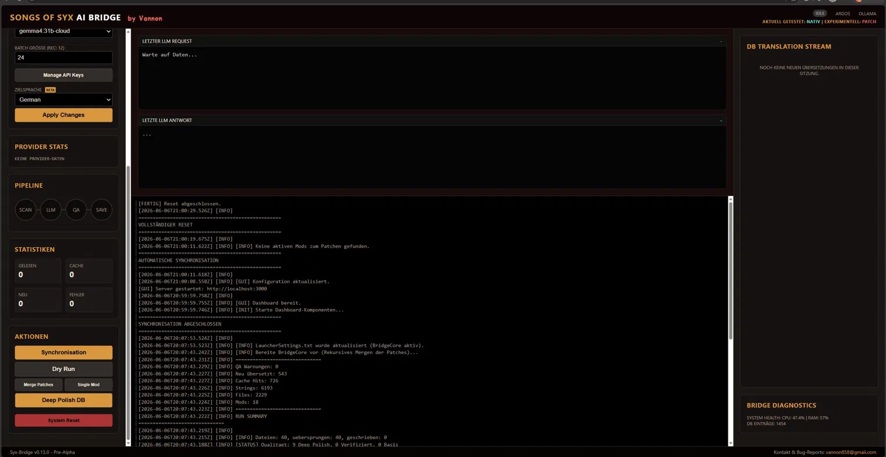

# Syx-Bridge - The Slaver's Translator (v0.14.0)

---

## 🛡️ Security & Integrity Update / Sicherheits-Update
**[EN] Why the Clean Slate?**  
This repository has been **re-initialized** as a clean baseline. During a routine check, several NPM security vulnerabilities were flagged. Upon investigation, further architectural defects were found that compromised the tool's long-term stability. To provide a safe and professional environment, the history was reset to this verified, "Deep-Cleaned" v0.14.0 baseline.

**[DE] Warum der Neustart?**  
Dieses Repository wurde als sauberer Baseline-Stand **neu aufgesetzt**. Bei einer Prüfung wurden kritische NPM-Sicherheitslücken gemeldet. Eine tiefergehende Analyse deckte weitere strukturelle Mängel auf, die die Stabilität gefährdeten. Um eine sichere und saubere Umgebung zu garantieren, wurde die Historie gelöscht und mit dieser verifizierten v0.14.0 "Deep-Clean" Baseline neu gestartet.

---

## 📢 Project Status: The Current Reality (v0.14.0)

### 🚀 Key Features & V71 Optimization (EN)
- **V71 Native Support:** Optimized for the latest *Songs of Syx* V71 update. The engine now handles new text structures and mod formats natively.
- **60fps Web-GUI:** A fluid dashboard (localhost:3000) for real-time monitoring of translation progress, CPU/RAM usage, and AI "thinking" streams.
- **Argos-Turbo:** Local, free translations using Base64-packet-batching. Up to 10x faster than traditional local methods.
- **DB Auditor (Tier A):** High-level AI audits the SQLite database to repair damaged technical markers (like `__VAR0__`) automatically.
- **Variable Shielding:** Game variables `{NAME}` or `<tag>` are protected by tokens `[[0]]` during translation to prevent game crashes.

### 🚀 Highlights & V71 Optimierung (DE)
- **V71 Native Support:** Optimiert für das neueste *Songs of Syx* V71 Update. Die Engine versteht die neuen Textstrukturen und Mod-Formate nativ.
- **60fps Web-GUI:** Ein flüssiges Dashboard (localhost:3000) zur Echtzeit-Überwachung von Fortschritt, CPU/RAM-Last und dem KI-"Live-Stream".
- **Argos-Turbo:** Kostenlose, lokale Übersetzungen via Base64-Paket-Bündelung. Bis zu 10x schneller als herkömmliche lokale Methoden.
- **DB Auditor (Tier A):** Eine Elite-KI prüft die SQLite-Datenbank und repariert beschädigte Platzhalter (`__VAR0__`) automatisch.
- **Variable Shielding:** Spiel-Variablen `{NAME}` oder `<tag>` werden durch Token `[[0]]` geschützt, um Spielabstürze zu verhindern.

---

## 🖥️ GUI Instructions / GUI Anleitung

### English
1. **Launch:** Run `start.bat`. The bridge will initialize and automatically open your default browser.
2. **Dashboard:** Monitor the "Heartbeat" (CPU/RAM) and see exactly which file is currently being processed.
3. **Inspector:** Use the built-in Inspector to review translations in the SQLite database before they are deployed as a patch.
4. **Bridge-Mode:** By default, it creates a "Patch Mod" in your `%APPDATA%`, keeping your original files untouched.

### Deutsch
1. **Start:** `start.bat` ausführen. Die Bridge initialisiert sich und öffnet automatisch den Browser.
2. **Dashboard:** Überwache den "Heartbeat" (CPU/RAM) und sieh live, welche Datei gerade übersetzt wird.
3. **Inspector:** Nutze den integrierten Inspector, um Übersetzungen in der SQLite-Datenbank zu prüfen, bevor sie als Patch ausgespielt werden.
4. **Bridge-Mode:** Standardmäßig wird ein "Patch Mod" in deinem `%APPDATA%` erstellt – deine Original-Mods bleiben sauber.

---

## 📂 Repository Structure
- `core/`: The translation engine (Node.js, SQLite, AI Dispatcher).
- `V70/` & `V71/`: Version-specific mapping and reference data for Songs of Syx versions.
- `scripts/`: Maintenance tools for database auditing, syntax checks, and "Redteam" baseline testing.

---

## 🛠️ Setup (Quickstart)

1. **Install:** [Node.js](https://nodejs.org/) (v18+).
2. **Prepare:** Run `npm install` in the `core` folder.
3. **Config:** Rename `.env.example` to `.env` and add your **Gemini API Key**.
4. **Run:** Double-click `start.bat` in the root directory.

---

### 💬 Support & Feedback
Bugs or logs: **vannon858@gmail.com**  
Please always attach `stdout.log` and `stderr.log` from the `core` directory.

*Happy Slaver-Management! / Viel Spaß beim Sklaven-Managen!*
