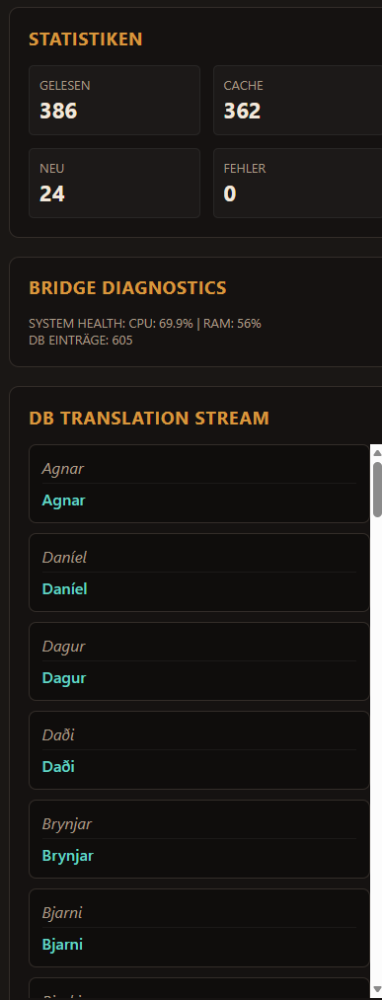
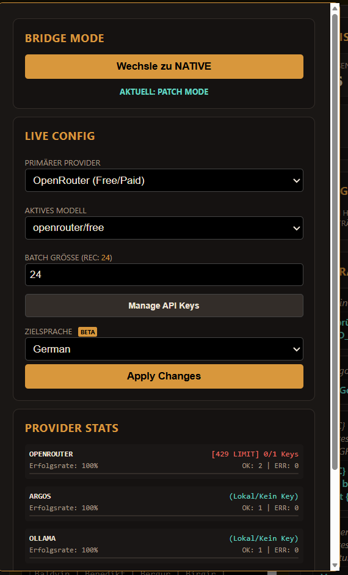

# Syx-Bridge — AI Translation Engine for Songs of Syx


> **Solo-Dev-Projekt von Vannon** · Built with mass amounts of caffeine, mass amounts of AI and mass amounts of stubbornness.
> 
> *"Ich wollte nur meine Mods auf Deutsch spielen. Jetzt hab ich eine KI-Pipeline mit Web-Dashboard gebaut. Tja."*

---

## 🛡️ Security & Integrity Update / Sicherheits-Update

**[EN] Why the Clean Slate?**  
This repository has been **re-initialized from scratch (git init)** to establish a clean baseline. During a routine audit, several critical NPM dependency chain vulnerabilities were flagged. To thoroughly eliminate these risks—and ensure no compromised packages remain in the project's history—we performed a complete GitHub relaunch. The code has been deep-cleaned and all dependencies have been updated to secure versions.

**[DE] Warum der GitHub-Relaunch?**  
Dieses Repository wurde **komplett neu aufgesetzt (git init)**. Bei einer Prüfung wurden kritische Schwachstellen in der NPM-Abhängigkeitskette (Dependency Chain) entdeckt. Um diese Sicherheitsrisiken restlos zu beseitigen und sicherzustellen, dass sich keine kompromittierten Pakete in der Versionshistorie befinden, haben wir einen sauberen Relaunch durchgeführt. Alle Abhängigkeiten wurden aktualisiert und das Projekt auf einen sicheren Stand gebracht.

**🔒 Strict Versioning Policy (Internal Standard)**  
To prevent future "dependency chain" vulnerabilities and automatic, unverified updates, this project enforces **Strict Versioning** in `package.json`. The use of carets (`^`) or tildes (`~`) is strictly prohibited. All dependencies must be pinned to exact versions (e.g., `"axios": "1.17.0"`). Any new dependency or version bump must be manually audited before being committed.

---

## 🎮 Was ist die Syx-Bridge? / What is this?

**DE:**  
Die Syx-Bridge ist ein KI-gestütztes Übersetzungstool für [Songs of Syx](https://store.steampowered.com/app/1162750/Songs_of_Syx/) Mods. Du startest eine `.bat`, ein Dashboard öffnet sich im Browser, und die Engine übersetzt deine Workshop-Mods automatisch in deine Sprache. Kein Copy-Paste, kein Google Translate – echte kontextbasierte KI-Übersetzung mit Qualitätskontrolle und Glossar-Learning.

**EN:**  
Syx-Bridge is an AI-powered translation engine for [Songs of Syx](https://store.steampowered.com/app/1162750/Songs_of_Syx/) mods. You run a `.bat` file, a dashboard opens in your browser, and the engine translates your subscribed Workshop mods automatically. No copy-paste, no Google Translate—real context-aware AI translation with quality control and glossary learning.

**Das Ding ist ein Solo-Projekt.** Ich (Vannon) baue das in meiner Freizeit, weil ich meine Lieblings-Mods auf Deutsch zocken will und kein Tool existiert hat, das das vernünftig kann. Es ist noch Alpha – aber es funktioniert, und es wird besser mit jedem Commit.

---

## 📸 Dashboard — Live-Screenshots (v0.14.2)

Keine Mock-ups, keine Photoshop-Tricks. Das hier sind echte Screenshots, direkt vom laufenden System.

---

### 1. ⚡ Die Engine im Run — Live Terminal

> **DE:** Sobald du auf **SYNC** drückst, wechselt das Dashboard in den Terminal-Modus. Hier siehst du live, was die KI gerade macht: Welcher Prompt rausgeht, was zurückkommt, welche Datei gerade dran ist. Der Neon-Fortschrittsbalken links zeigt dir Phase, aktive Threads und den aktuellen Mod-Namen. Kein Blindflug.
>
> **EN:** Hit **SYNC** and the dashboard switches to terminal mode. Watch the AI work in real-time: outgoing prompts, incoming responses, current file. The neon progress bar on the left tracks phase, active threads, and the mod currently being processed. No guesswork.

---

### 2. ⚙️ Einstellungen & DB Browser — Das Kontrollzentrum

> **DE:** Über den **"API & EINSTELLUNGEN"**-Button klappst du das Config-Menü auf: API-Keys, Bridge-Mode (Patch vs. Overwrite), Provider-Auswahl. Im Idle-Zustand zeigt die Mitte den **Datenbank-Browser** – klick auf eine Übersetzung, ändere sie, speichere. Fertig. Kein SQL nötig.
>
> **EN:** The **"API & EINSTELLUNGEN"** button opens the config overlay: API keys, Bridge mode (Patch vs. Overwrite), provider selection. When idle, the center panel becomes a **Database Browser**—click any translation, edit inline, save. Done.

---

### 3. 📊 Live Stats & System Health

> **DE:** Die Diagnostics-Sektion zeigt dir die harten Fakten: Wie viele Dateien gelesen, wie viele Übersetzungen aus dem Cache kamen (spart API-Kosten!), wie viele neu übersetzt wurden und ob Fehler aufgetreten sind. Dazu CPU/RAM-Auslastung in Echtzeit.
>
> **EN:** The diagnostics section shows the hard numbers: files scanned, cache hits (saving API costs!), new translations, and errors. Plus real-time CPU/RAM monitoring.

---

## 🔧 Was kann die Bridge? / Core Features

| Feature | Beschreibung / Description |
|---|---|
| **Multi-Provider AI** | Gemini, Groq, Ollama (lokal), Argos (offline) — automatisches Fallback zwischen Providern |
| **3-Stufen-Pipeline** | `Translate → Verify → Deep Polish` — jede Übersetzung durchläuft bis zu 3 Qualitätsstufen |
| **Variable Shielding** | Spiel-Variablen wie `{NAME}` oder `<tag>` werden durch sichere Tokens geschützt, damit nichts kaputtgeht |
| **Glossar-Learning** | Die Engine merkt sich Terminologie und wendet sie konsistent an |
| **SQLite Cache** | Einmal übersetzt = gespeichert. Kein doppeltes API-Budget für denselben Text |
| **Patch Mode** | Erstellt einen separaten Patch-Mod in `%APPDATA%` — deine Original-Mods bleiben unberührt |
| **Web-Dashboard** | Echtzeit-Monitoring auf `localhost:3000` mit Live-Terminal, DB-Browser und System-Diagnostics |
| **Deep Polish** | KI-gestützte Nachbearbeitung: Grammatik, Stil und Terminologie werden nochmal durchgecheckt |
| **Steam Workshop Export** | Direkt-Upload des fertigen Übersetzungs-Patches in den Steam Workshop |

---

## 🛠️ Setup — In 4 Schritten loslegen

```
1. Node.js installieren  →  https://nodejs.org/ (v18+)
2. Repository klonen      →  git clone https://github.com/vannon091118/Syx_bridge-
3. .env konfigurieren     →  GEMINI_KEY=dein_api_key  (im Root-Ordner)
4. Starten                →  start.bat doppelklicken
```

> **Das war's.** Die `start.bat` installiert beim ersten Start automatisch alle Dependencies, prüft Argos, erstellt eine `.env`-Vorlage falls nötig, und öffnet das Dashboard im Browser.
>
> **That's it.** On first run, `start.bat` auto-installs dependencies, checks Argos, creates a `.env` template if needed, and opens the dashboard in your browser.

---

## 📂 Projekt-Struktur

```
Syx_bridge-/
├── start.bat              # One-Click Launcher
├── .env                   # API Keys & Konfiguration (nicht in Git)
├── Banner.png             # Repo Banner
│
├── core/                  # Die Translation Engine
│   ├── index.js           # Einstiegspunkt (CLI + GUI)
│   ├── src/
│   │   ├── gui/           # Web-Dashboard (Express + WebSocket)
│   │   ├── translation-runtime.js   # Batch-Übersetzung, Cache, Polish
│   │   ├── dispatcher.js  # Stage-Routing (translate/audit/polish)
│   │   ├── text-core.js   # Shielding, Prompts, Parsing
│   │   ├── glossary.js    # Terminologie-Memory
│   │   ├── planner.js     # Lauf-Orchestrierung
│   │   ├── exporter.js    # Dateiausgabe (Patch/Native Mode)
│   │   └── ...            # Scanner, Router, Validator, Logger
│   └── scripts/           # Wartungstools (Audit, Syntax-Check, Workshop)
│
├── V70/ & V71/            # Versions-spezifische Referenzdaten
└── rewrite.py / .js       # Interne GUI-Restrukturierungs-Helfer
```

---

## 📋 Changelog

→ Vollständiges, detailliertes Changelog: **[core/CHANGELOG.md](core/CHANGELOG.md)**

| Version | Datum | Highlights |
|---|---|---|
| `v0.16.0` | 2026-06-15 | Dynamisches Risiko-Scoring, persistConfig konsolidiert, ESLint 0/0, Audit 7/7 ✅ |
| `v0.15.4` | 2026-06-15 | Native Mode: Backup immer, Polish immer, _Info.txt geschützt |
| `v0.15.3` | 2026-06-14 | Ollama/Player2 in Stage-Requests |
| `v0.15.2` | 2026-06-14 | PLAYER2-Keys persistiert, Config-Divergenz behoben |
| `v0.15.1` | 2026-06-14 | Shielding, Quotes, Cleanup, Imports, Prompt-Konsistenz |
| `v0.15.0` | 2026-06-14 | GUI Overhaul, DB-Browser, Live-Terminal, Strict Versioning |
| `v0.13.0a`| 2026-06-06 | Linux-Support, Gemini-API-Fixes |
| `v0.9.6β` | Pre-Rel. | Dispatcher, Risiko-Scores, Glossar-Learning |

---

## ⚠️ Status: Alpha

**Klartext:** Die Bridge funktioniert und ich nutze sie selbst täglich. Aber es ist ein Solo-Projekt in aktiver Entwicklung. Dinge können brechen, APIs können sich ändern, und manche Features sind "works on my machine"-getestet. Wenn du damit klarkommst — willkommen an Bord.

**Honest take:** The bridge works and I use it daily. But it's a solo project in active development. Things may break, APIs may change, and some features are "works on my machine"-tested. If you're cool with that — welcome aboard.

---

### 💬 Feedback & Bugs

**Email:** vannon858@gmail.com  
Bitte immer `log.txt` und die Konsolenausgabe mitsenden. / Please always include `log.txt` and the console output.

---

*Happy Slaver-Management! / Viel Spaß beim Sklaven-Managen!* 🎮
