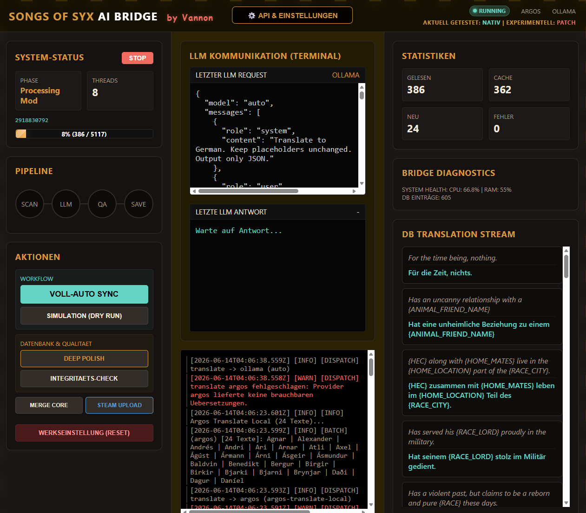

# SyxBridge — AI Translation Engine for Songs of Syx

<p align="center">
  
</p>

<p align="center">
  <a href="#-what-is-syxbridge"></a>
  <a href="#-was-ist-syxbridge"></a>
  
  
  
  
  
  
</p>

<p align="center">
  <strong>Built accidentally. Runs intentionally.</strong>
</p>

<p align="center">
  <em>"I just wanted to play my mods in German. Now I have an AI pipeline with a web dashboard, key rotation, a capability matrix, and a stress test system. Something went wrong somewhere."</em>
</p>

---

<details open>
<summary><h2>🇬🇧 English</h2></summary>

### 🎮 What is SyxBridge?

You have Songs of Syx. You have 50 mods. They're all in English. You could manually translate 3,000+ strings — or you double-click a `.bat` file and let an AI pipeline handle it.

**SyxBridge** scans your installed Workshop mods, runs the text through a multi-stage AI translation pipeline, and writes translations back to your game files. With a web dashboard, real-time monitoring, and quality control built-in.

> Solo project by **Vannon** · Built with mass amounts of caffeine, AI, and stubbornness.

---

### ⚡ Highlights

<table>
<tr>
<td width="50%">

**🤖 9 AI Providers**
Gemini · Groq · OpenRouter · NVIDIA NIM · FCM · Ollama · Player2 · Argos (offline) · Google Translate Free

Automatic provider rotation with capability matrix. Each provider knows what it can do — and what it can't.

</td>
<td width="50%">

**📊 Web Dashboard**
Real-time monitoring on `localhost:3000` with live terminal, provider health, DB browser, and statistics.

Because terminal-only in 2026 would be embarrassing.

</td>
</tr>
<tr>
<td>

**🔄 3-Stage Pipeline**
`Translate → Audit → Polish`
Every translation goes through up to 3 quality stages. Dynamic risk scoring decides what gets a second look.

</td>
<td>

**🔐 Key Rotation & Cooldown**
Multiple API keys per provider. Automatic rotation on rate limits. 30–60s cooldown.
Your keys will outlive my sleep schedule.

</td>
</tr>
<tr>
<td>

**🛡️ Placeholder Shielding**
`{NAME}`, `{AGE}`, `<tag>` — all protected. Glossary learning ensures "Hive Queen" stays "Hive Queen" on page 47 too.

</td>
<td>

**💾 SQLite Cache & Backup**
Translated once = cached forever. Automatic backup of all originals before overwriting. API costs? What API costs?

</td>
</tr>
</table>

---

### 📸 Dashboard — Live Screenshots

<table>
<tr>
<td align="center" width="60%">

**Run Mode · Live Terminal**

*Live prompts, LLM responses, progress bars — no guesswork.*

</td>
<td align="center" width="40%">

**Config & Provider Health**

*Provider selection, model list, key manager, success rates.*

</td>
</tr>
</table>

---

### 🛠️ Quickstart — 4 Steps

```bash
# 1. Install Node.js (v18+)
#    → https://nodejs.org/

# 2. Clone the repository
git clone https://github.com/vannon091118/Syx_bridge-
cd Syx_bridge-

# 3. (Optional) Add API keys to .env
#    Without keys → Google Translate Free + Argos (completely free)

# 4. Launch
start.bat
```

> The `.bat` auto-installs dependencies, creates a `.env` template, and opens `localhost:3000`.
> Add your keys in the dashboard under **"Manage API Keys"**, hit **SYNC**, done.

---

### 🔧 Full Feature List

| Feature | Description |
|---|---|
| **9 Providers** | Gemini, Groq, OpenRouter, NVIDIA NIM, FCM, Ollama, Player2, Argos (offline), Google Translate Free |
| **Capability Matrix** | Each provider has defined capabilities (translate/audit/polish). No accidents. |
| **Key Rotation** | Multiple keys per provider, automatic rotation on rate limits, 30–60s cooldown |
| **Local Models Opt-in** | Ollama/Player2 locked by default (hardware protection). Explicit opt-in required. |
| **3-Stage Pipeline** | Translate → Audit → Polish. Up to 3 quality stages per translation. |
| **Dynamic Risk Scoring** | Texts are scored by risk. Ambiguous batches get stress-tested. |
| **JSON Retry** | On parse failure, one retry with stricter prompt. |
| **Placeholder Shielding** | `{NAME}`, `{AGE}`, `<tag>` protected through token replacement. |
| **Glossary Learning** | Terminology memory with consistent application across all mods. |
| **SQLite Cache** | Translated once = stored forever. Massive API cost savings. |
| **Native & Patch Mode** | Native overwrites originals (with backup). Patch creates separate mod folder. Both are user-controlled. |
| **Web Dashboard** | Real-time monitoring, DB browser, live terminal on `localhost:3000`. |
| **Steam Workshop Export** | Direct upload of your translation patch to Steam Workshop. |
| **Backup System** | Automatic backup of all originals before first overwrite. |
| **5-Layer Watermark Defense** | ZWSP/ZWNJ watermarks stripped at every entry point — disk read, classification, DB boundary. |
| **Plugin Architecture** | Game adapter system. Songs of Syx is the reference implementation. New games slot in via registry. |
| **Dev Tools** | `db_query.js`, `db_snapshot.js`, `log_sorter.js`, `test_providers.js` — maintainability built in. |

---

### 📂 Project Structure

```
Syx_bridge-/
├── start.bat                      # One-click launcher
├── .env                           # Your keys (don't commit this)
├── AGENTS.md                      # Agent protocol & commit rules
│
├── core/
│   ├── index.js                   # Entry point (CLI + GUI mode)
│   ├── src/
│   │   ├── runtime-ops.js         # Orchestration: scan → translate → write
│   │   ├── translation-runtime.js # Batch translation, cache, polish
│   │   ├── sos-runtime.js         # Songs of Syx game adapter (plugin-backed)
│   │   ├── router.js              # Provider routing + capability matrix
│   │   ├── text-core.js           # Shielding, prompt building, JSON parsing
│   │   ├── translation-db.js      # SQLite cache + watermark defense
│   │   ├── preflight.js           # DB health check before every run
│   │   ├── plugin-registry.js     # Game plugin factory & registry
│   │   ├── plugins/               # Plugin implementations
│   │   │   ├── SongsOfSyxPlugin.js
│   │   │   └── GamePlugin.js      # Abstract base
│   │   └── gui/                   # Web dashboard (Express + SSE)
│   ├── scripts/
│   │   ├── commit_lore/           # Commit narrative tools
│   │   │   ├── get_sidejoke.js    # Random commit opener from pool
│   │   │   ├── build_pool.js      # Rebuild pool from git history
│   │   │   └── update_plot.js     # Append dialogue to PLOT_LORE.md
│   │   ├── db_query.js            # SQLite CLI query runner
│   │   ├── db_snapshot.js         # DB snapshot + trend report
│   │   ├── log_sorter.js          # Multi-run log filter/sorter
│   │   └── verify_commit_msg.js   # RULE 3 commit gate
│   ├── tests/
│   │   ├── plugin-boundary-contract.js  # 76 contract checks: Plugin ↔ Adapter interface
│   │   └── e2e_bug1_native_mode.js      # 35 E2E checks: Native Mode gate
│   └── archive/docs/
│       ├── CHANGELOG.md           # Persistent change log (never archived)
│       ├── PLOT_LORE.md           # External narrative layer — agent dialogues
│       ├── MASTER_DOC.md          # Architecture reference
│       └── KNOWN_BUGS_REPORT.md   # Open issues
```

---

### 📋 Changelog (Excerpt)

| Version | Date | Highlights |
|---|---|---|
| **v0.21.0-untested** | 2026-06-21 | Current release — Runtime Score Dashboard, ESLint 0-error, G1-Test fix, Livetest bestanden |
| **v0.21-exp** | 2026-06-20—21 | Stabilisierungsphase: Native Mode Fix (V6/V7 Filter entfernt, German-Pfad, BridgeCore preserved), PREFLIGHT-Härtung, Plugin-Architektur, 5-Layer Watermark Defense, 2.702 DB-Einträge |
| **v0.20.0** | 2026-06-20 | Global Bump + Chain Hardening — BU-035 to BU-039, Plugin Architecture |
| v0.19.7 | 2026-06-18 | PREFLIGHT fix + Routing hardening + smart Error-Handler |

→ **Full changelog:** [`CHANGELOG.md`](core/archive/docs/CHANGELOG.md)  
→ **Plot & Agent Dialogues:** [`PLOT_LORE.md`](core/archive/docs/PLOT_LORE.md)

---

### 📊 Runtime Score — 90.1% (Gewichtete Wahrscheinlichkeit)

Der **Runtime Score** misst die Wahrscheinlichkeit, dass SyxBridge auf einem beliebigen Fremdsystem ohne Eingriff läuft. Berechnet als gewichteter Durchschnitt über 8 Nutzer-Personas:

$$P_{global} = \frac{\Sigma(P_i \times w_i)}{\Sigma w_i} = 90.1\%$$

| Persona | P (Wahrscheinlichkeit) | Gewicht (Bevölkerungsanteil) | Beitrag |
|---------|----------------------|------------------------------|---------|
| **Casual User** (API-Keys vorhanden, Standard-HW) | 97.5% | 35% | 34.1% |
| **Mid-Range mit Keys** (gute GPU + API-Keys) | 97.0% | 15% | 14.6% |
| **Mid-Range ohne Keys** (gute GPU, nur Google Free) | 85.0% | 25% | 21.3% |
| **Schwache HW** (Steam Deck 4GB RAM) | 74.0% | 10% | 7.4% |
| **Power Workstation + Ollama** (Lokalmodell) | 94.0% | 8% | 7.5% |
| **Headless Linux Server** (CLI-only) | 87.5% | 2% | 1.8% |
| **Power-API-User** (teure Keys, exotische Konfiguration) | 77.0% | 3% | 2.3% |
| **Offline / Air-gapped** (Google Free + Argos) | 60.0% | 2% | 1.2% |

> **Formel:** Gewichteter Durchschnitt — jedes Persona-P (Wahrscheinlichkeit) wird mit seinem Bevölkerungsgewicht w multipliziert, die Summe ergibt den globalen Score.
> **Berechnung:** `core/scripts/runtime_score.js` — ausführbar als CLI-Tool mit `--write-history`.
> **Datenquelle:** `core/data/current_score.json` — live im Web-Dashboard unter Runtime Score Panel sichtbar.
> **Git-Commit:** `980de4a` (2026-06-21) — 8 Personas, 90.105% global.

---

### ⚠️ Status: Alpha — Honest Assessment

| | |
|---|---|
| **Version** | v0.21.0-untested (active development branch) |
| **Maturity** | Alpha · Solo project · In daily use by the author |
| **DB** | 2.702 translated entries, 0 watermarks, 0 flagged (as of 2026-06-21) |
| **Score** | 90.1% Runtime Score — siehe Erklärung unten |
| **Tests** | 111 PASS · 0 FAIL (npm test: plugin-boundary-contract + e2e native mode) · +22 P0-Verify |
| **Patch Mode** | User opt-in via `.env` `PATCH_MODE_ENABLED=true`. Default: off. Fully functional. |

<details>
<summary><b>Known Issues</b></summary>

| ID | Issue | Severity |
|----|-------|----------|
| LIVE-1 | Post-run verification needed: German texts loading in-game after Native Mode fix | 🟠 P1 |
| F.D | Audit `.jsonl` data committed — should these be in `.gitignore`? | 🟢 P3 |
| — | sos-runtime.js: needs lazy-load guard for `activePlugin` (module-level init may fail on missing env) | 🟡 P2 |

</details>

---

### 📧 Contact & Bug Reports

**Email:** [vannon858@gmail.com](mailto:vannon858@gmail.com)

**When reporting bugs, please include:**
- `log.txt` + `debug_payloads.txt`
- Your `.env` (without keys — I don't want them. Seriously. Mask them.)

---

</details>

---

<details>
<summary><h2>🇩🇪 Deutsch</h2></summary>

> <strong>Aus Versehen gebaut. Läuft mit Absicht.</strong>

### 🎮 Was ist SyxBridge?

Du hast Songs of Syx. Du hast 50 Mods. Die sind alle auf Englisch. Du könntest 3.000+ Texte von Hand übersetzen — oder du startest **eine** `.bat`-Datei und lässt eine KI-Pipeline die Arbeit erledigen.

**SyxBridge** scannt deine installierten Workshop-Mods, jagt die Texte durch eine mehrstufige KI-Pipeline und schreibt die Übersetzungen direkt zurück. Mit Web-Dashboard, Echtzeit-Monitoring und Qualitätskontrolle — weil "gut genug" nicht reicht wenn du 50 Mods hast.

> Solo-Dev-Projekt von **Vannon** · Built with mass amounts of caffeine, AI, and stubbornness.

---

### ⚡ Highlights

<table>
<tr>
<td width="50%">

**🤖 9 AI-Provider**
Gemini · Groq · OpenRouter · NVIDIA NIM · FCM · Ollama · Player2 · Argos (offline) · Google Translate Free

Automatische Provider-Rotation mit Capability-Matrix. Jeder Provider weiß, was er kann — und was nicht.

</td>
<td width="50%">

**📊 Web-Dashboard**
Echtzeit-Monitoring auf `localhost:3000` mit Live-Terminal, Provider-Health, DB-Browser und Statistiken.

Kein Terminal-only in 2026.

</td>
</tr>
<tr>
<td>

**🔄 3-Stufen-Pipeline**
`Translate → Audit → Polish`
Jede Übersetzung durchläuft bis zu 3 Qualitätsstufen. Dynamisches Risk-Scoring entscheidet, wer nochmal drüber schaut.

</td>
<td>

**🔐 Key-Rotation & Cooldown**
Mehrere API-Keys pro Provider. Automatische Rotation bei Rate-Limits. 30–60s Cooldown.
Deine Keys überleben länger als mein Schlafrhythmus.

</td>
</tr>
<tr>
<td>

**🛡️ Placeholder Shielding**
`{NAME}`, `{AGE}`, `<tag>` — alles geschützt. Glossar-Learning sorgt dafür, dass „Schwarm-Königin" auch auf Seite 47 noch „Schwarm-Königin" heißt.

</td>
<td>

**💾 SQLite Cache & Backup**
Einmal übersetzt = gespeichert. Automatische Sicherung aller Originale vor dem ersten Überschreiben. API-Kosten? Welche API-Kosten?

</td>
</tr>
</table>

---

### 📸 Dashboard — Live-Screenshots

<table>
<tr>
<td align="center" width="60%">

**Run-Modus · Live-Terminal**

*Live-Prompts, LLM-Antworten, Fortschrittsbalken — kein Blindflug.*

</td>
<td align="center" width="40%">

**Config & Provider-Health**

*Provider-Auswahl, Modell-Liste, Key-Manager, Erfolgsraten.*

</td>
</tr>
</table>

---

### 🛠️ Quickstart — 4 Schritte

```bash
# 1. Node.js installieren (v18+)
#    → https://nodejs.org/

# 2. Repository klonen
git clone https://github.com/vannon091118/Syx_bridge-
cd Syx_bridge-

# 3. (Optional) .env mit API-Keys füllen
#    Ohne Keys → Google Translate Free + Argos (komplett kostenlos)

# 4. Starten
start.bat
```

> Die `.bat` installiert automatisch alle Dependencies, erstellt eine `.env`-Vorlage und öffnet `localhost:3000`.
> Keys im Dashboard unter **„Manage API Keys"** eintragen, **SYNC** drücken, fertig.

---

### 🔧 Alle Features

| Feature | Beschreibung |
|---|---|
| **9 Provider** | Gemini, Groq, OpenRouter, NVIDIA NIM, FCM, Ollama, Player2, Argos (offline), Google Translate Free |
| **Capability Matrix** | Jeder Provider hat definierte Fähigkeiten (translate/audit/polish). Kein Unfall. |
| **Key-Rotation** | Mehrere Keys pro Provider, automatische Rotation bei Rate-Limits, 30–60s Cooldown |
| **Lokale Modelle Opt-in** | Ollama/Player2 standardmäßig gesperrt (Hardware-Schutz). Erst nach explizitem Opt-in. |
| **3-Stufen-Pipeline** | Translate → Audit → Polish. Bis zu 3 Qualitätsstufen pro Übersetzung. |
| **Dynamic Risk Scoring** | Texte werden nach Risiko bewertet. Ambiguous-Batches kriegen Stress-Test. |
| **JSON-Retry** | Bei Parse-Failure einmaliger Retry mit strikterem Prompt. |
| **Placeholder Shielding** | `{NAME}`, `{AGE}`, `<tag>` geschützt durch Token-Replacement. |
| **Glossar-Learning** | Terminologie-Memory mit konsistenter Anwendung über alle Mods. |
| **SQLite Cache** | Einmal übersetzt = gespeichert. Spart API-Kosten massiv. |
| **Native & Patch Mode** | Native überschreibt Originale (mit Backup). Patch erstellt separaten Mod-Ordner. Beides steuerbar. |
| **Web-Dashboard** | Echtzeit-Monitoring, DB-Browser, Live-Terminal auf `localhost:3000`. |
| **Steam Workshop Export** | Direkt-Upload deines Übersetzungspatches in den Workshop. |
| **Backup-System** | Automatische Sicherung aller Originale vor dem ersten Überschreiben. |
| **Plugin-Architektur** | Game-Adapter-System. Songs of Syx ist die Referenzimplementierung. Neue Spiele per Registry. |

---

### 📂 Projektstruktur

```
Syx_bridge-/
├── start.bat                      # Ein-Klick-Starter
├── .env                           # Deine Keys (nicht committen)
├── AGENTS.md                      # Agenten-Protokoll & Commit-Regeln
│
├── core/
│   ├── index.js                   # Einstiegspunkt (CLI + GUI-Mode)
│   ├── src/
│   │   ├── runtime-ops.js         # Orchestrierung: Scan → Übersetzen → Schreiben
│   │   ├── translation-runtime.js # Batch-Übersetzung, Cache, Polish
│   │   ├── sos-runtime.js         # Songs of Syx Game-Adapter (Plugin-backed)
│   │   ├── router.js              # Provider-Routing + Capability-Matrix
│   │   ├── text-core.js           # Shielding, Prompt-Bau, JSON-Parsing
│   │   ├── translation-db.js      # SQLite Cache + Watermark-Defense
│   │   ├── preflight.js           # DB-Health-Check vor jedem Run
│   │   ├── plugin-registry.js     # Game-Plugin-Factory & Registry
│   │   ├── plugins/               # Plugin-Implementierungen
│   │   │   ├── SongsOfSyxPlugin.js
│   │   │   └── GamePlugin.js      # Abstrakte Basis
│   │   └── gui/                   # Web-Dashboard (Express + SSE)
│   ├── scripts/
│   │   ├── commit_lore/           # Commit-Erzählungs-Tools
│   │   │   ├── get_sidejoke.js    # Zufälliger Commit-Einstieg aus Pool
│   │   │   ├── build_pool.js      # Pool aus Git-History neu aufbauen
│   │   │   └── update_plot.js     # Dialog an PLOT_LORE.md anhängen
│   │   ├── db_query.js            # SQLite CLI Query-Runner
│   │   ├── db_snapshot.js         # DB-Snapshot + Trend-Report
│   │   ├── log_sorter.js          # Multi-Run Log-Filter/Sorter
│   │   └── verify_commit_msg.js   # RULE 3 Commit-Gate
│   ├── tests/
│   │   ├── plugin-boundary-contract.js  # 76 Contract-Checks: Plugin ↔ Adapter Interface
│   │   └── e2e_bug1_native_mode.js      # 35 E2E-Checks: Native-Mode-Gate
│   └── archive/docs/
│       ├── CHANGELOG.md           # Persistentes Änderungslog (niemals archiviert)
│       ├── PLOT_LORE.md           # Externer Narrativ-Layer — Agenten-Dialoge
│       ├── MASTER_DOC.md          # Architektur-Referenz
│       └── KNOWN_BUGS_REPORT.md   # Offene Issues
```

---

### 📋 Changelog (Auszug)

| Version | Datum | Highlights |
|---|---|---|
| **v0.21.0-untested** | 2026-06-21 | Aktuelles Release — Runtime Score Dashboard, ESLint 0-Error, G1-Test-Reparatur, Livetest bestanden |
| **v0.21-exp** | 2026-06-20—21 | Stabilisierungsphase: Native Mode Fix, PREFLIGHT-Härtung, Plugin-Architektur, 5-Layer Watermark Defense, 2.702 DB-Einträge |
| **v0.20.0** | 2026-06-20 | Global Bump + Chain Hardening — BU-035 bis BU-039, Plugin-Architektur |
| v0.19.7 | 2026-06-18 | PREFLIGHT-Fix + Routing-Härtung + smarter Error-Handler |

→ **Vollständiges Changelog:** [`CHANGELOG.md`](core/archive/docs/CHANGELOG.md)  
→ **Plot & Agenten-Dialoge:** [`PLOT_LORE.md`](core/archive/docs/PLOT_LORE.md)

---

### 📊 Runtime Score — 90.1% (Gewichtete Wahrscheinlichkeit)

Der **Runtime Score** misst die Wahrscheinlichkeit, dass SyxBridge auf einem beliebigen Fremdsystem ohne Eingriff läuft. Berechnet als gewichteter Durchschnitt über 8 Nutzer-Personas:

$$P_{global} = \frac{\Sigma(P_i \times w_i)}{\Sigma w_i} = 90.1\%$$

| Persona | P (Wahrscheinlichkeit) | Gewicht | Beitrag |
|---------|----------------------|---------|---------|
| **Casual User** | 97.5% | 35% | 34.1% |
| **Mid-Range mit Keys** | 97.0% | 15% | 14.6% |
| **Mid-Range ohne Keys** | 85.0% | 25% | 21.3% |
| **Schwache HW** | 74.0% | 10% | 7.4% |
| **Power + Ollama** | 94.0% | 8% | 7.5% |
| **Headless Server** | 87.5% | 2% | 1.8% |
| **Power-API-User** | 77.0% | 3% | 2.3% |
| **Offline / Air-gapped** | 60.0% | 2% | 1.2% |

> **Formel:** Gewichteter Durchschnitt. Jedes P × w ergibt einen Beitrag, die Summe = 90.1%.
> **Berechnung:** `core/scripts/runtime_score.js` (`--write-history`).
> **Anzeige:** Web-Dashboard » Runtime Score Panel.

---

### ⚠️ Status: Alpha — Ehrliche Ansage

| | |
|---|---|
| **Version** | v0.21.0-untested (aktiver Entwicklungs-Branch) |
| **Reifegrad** | Alpha · Solo-Projekt · im Daily-Use des Autors |
| **DB** | 2.702 übersetzte Einträge, 0 Watermarks, 0 Geflaggte (Stand 2026-06-21) |
| **Score** | 90.1% Runtime Score (gewichtete Wahrscheinlichkeit über 8 Personas) |
| **Tests** | 111 PASS · 0 FAIL (npm test) · +22 P0-Verify |
| **Patch Mode** | User Opt-in via `.env` `PATCH_MODE_ENABLED=true`. Standard: aus. Voll funktional. |

<details>
<summary><b>Known Issues</b></summary>

| ID | Fehler | Severity |
|----|--------|----------|
| LIVE-1 | Verifikation ausstehend: Deutsche Texte im Spiel nach Native-Mode-Fix | 🟠 P1 |
| F.D | Audit-`.jsonl`-Daten committed — gehören in `.gitignore`? | 🟢 P3 |
| — | sos-runtime.js: Lazy-Load-Guard für `activePlugin` fehlt (Modul-Level-Init könnte bei fehlendem env scheitern) | 🟡 P2 |

</details>

---

### 📧 Kontakt & Bug-Reports

**Email:** [vannon858@gmail.com](mailto:vannon858@gmail.com)

**Bei Bug-Reports bitte mitsenden:**
- `log.txt` + `debug_payloads.txt`
- `.env` (ohne Keys — ich will die nicht. Ernsthaft. Maskier sie.)

---

</details>

---

<p align="center">
  <em>No Scrum Masters were harmed during the development of this project.</em><br>
  <em>Kein Scrum-Master wurde bei der Entwicklung dieses Projekts verletzt.</em>
</p>

<p align="center">
  <sub>MIT License · © 2026 Vannon · Happy Slaver-Management! 🎮</sub>
</p>
