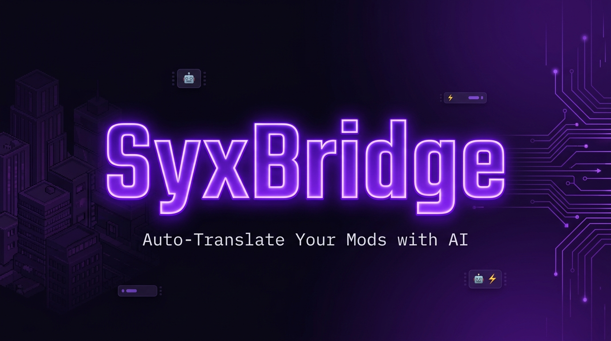

<div align="center">



<br/>

<!-- BADGES — STATUS BOARD -->
<a href="https://github.com/vannon091118/Syx_Bridge-Auto-Translate-Mods/releases"></a>&nbsp;
<a href="#"></a>&nbsp;
<a href="#-quality-metrics--qualit%C3%A4tsmetriken"></a>&nbsp;
<a href="#"></a>&nbsp;
<a href="#"></a>&nbsp;
<a href="LICENSE"></a>

<br/><br/>

<a href="#-quickstart"></a>&nbsp;
<a href="#-the-dashboard--das-dashboard"></a>&nbsp;
<a href="#-roadmap"></a>&nbsp;
<a href="mailto:vannon858@gmail.com"></a>

</div>

---

<div align="center">

> *„Ich wollte nur meine Mods auf Deutsch spielen.*
> *Jetzt hab ich eine KI-Pipeline mit Web-Dashboard, Key-Rotation, Capability-Matrix und Stresstest-System.*
> *Irgendwas ist schiefgelaufen."*

**DE** · [EN ↓](#english-version)

</div>

---

## Was ist SyxBridge?

**Du hast Mods. Die sind auf Englisch. Das nervt.**

SyxBridge ist eine vollautomatische Mod-Übersetzungs-Pipeline für Strategiespiele. Du wirfst einen Mod-Ordner rein — raus kommt dieselbe Mod, auf Deutsch (oder jede andere Sprache). Keine manuelle Arbeit, keine zerstörten Lore-Begriffe, kein API-Rätselraten.

> [!IMPORTANT]
> **Das hier ist kein Wrapper um Google Translate.** Es ist eine vollständige Pipeline mit Placeholder-Schutz, Glossar-System, LLM-Audit-Pass, SQLite-Cache, Smart-Routing über 10 Provider und einem Web-Dashboard das live zeigt was passiert.

<details>
<summary><b>🎯 Drei reale Use-Cases</b></summary>
<br/>

| Situation | Was SyxBridge tut |
|:---|:---|
| 50 Mods, alle EN, Familie will mitspielen | `start.bat` → Kaffee → Mods auf DE |
| Du willst deinen Mod übersetzt im Workshop hochladen | Patch-Mode: separater Übersetzungsmod, Original unangetastet |
| Google Translate zerstört deinen Lore | Glossar-System + Placeholder-Schutz + Audit-Pass — Begriffe bleiben konsistent |

</details>

---

## 🔬 Was es tatsächlich tut | How it actually works

```
📁  SCAN      →  Findet alle übersetzbaren Strings im Mod-Ordner
🛡️  SHIELD    →  Ersetzt Platzhalter ({NAME}, {VAR}) mit internen Markern — LLM sieht sie nie
🤖  TRANSLATE →  LLM übersetzt Batch-weise. Schlechtes Ergebnis? Zweites Modell prüft nach.
✨  POLISH    →  Lore-Anpassung, Glossar-Matching, Stil-Konsistenz
💾  CACHE     →  SQLite. Nächster Run: nur neue Strings kosten API-Budget
📝  WRITE     →  Direkt in Mod-Dateien (Native) oder als separater Patch-Mod
```

Keine Black Box. Das Dashboard zeigt live welcher String gerade läuft, welcher Provider antwortet, was das Ergebnis ist — inklusive Revisionshistorie pro String.

---

## ⚡ Smart Routing — 10 Provider

Das System hat eine interne Capability-Matrix. Du gibst Strings rein, es wählt automatisch den besten verfügbaren Provider. Automatische Key-Rotation gegen Rate-Limits. Keys liegen nur lokal in deiner `.env`.

<div align="center">

| Tier | Provider | Was du brauchst |
|:---:|:---|:---|
| 🟢 **Free** | Google Translate *(Built-in)*, FCM Daemon | Nix — läuft sofort |
| 🟡 **Offline** | Argos Translate | Nix — lokale Modelle, kein Internet |
| 🔵 **API** | Groq, OpenRouter, Gemini, NVIDIA NIM, OpenAI, Custom API | API-Key in `.env` |
| ⚡ **Local AI** | Ollama, Player2 | Lokale KI + GPU |

</div>

> [!TIP]
> **Kein API-Key? Kein Problem.** SyxBridge läuft vollständig offline mit Argos Translate oder gratis mit Google Translate. Keys erweitern nur die Qualität — sie sind keine Pflicht.

---

## 🖥 The Dashboard | Das Dashboard

<div align="center">

| 💤 Idle — DB Browser | ▶️ Run — Live Terminal |
|:---:|:---:|
|  |  |
| **3.288 gecachte Strings** durchsuchen, editieren, Revisionshistorie abrufen | **Live-Prompts, Provider-Status, Progress** — kein Rätselraten mehr |

</div>

<details>
<summary><b>🔍 Dashboard Features im Detail</b></summary>
<br/>

- **Pipeline-Visualizer** — 4 Phasen live sichtbar: `SCAN → LLM → QA → SAVE`
- **DB-Browser** — SQLite-Cache direkt durchsuchen und manuell editieren
- **Revisionshistorie** — jeder String hat eine vollständige Änderungshistorie
- **FCM Live Rankings** — Modell-Tiers, Ping, Stabilität, One-Click Switch
- **API-Key-Manager** — Keys verwalten und live testen direkt aus dem UI
- **Runtime Score Panel** — Echtzeit-Qualitätsmetriken nach jedem Sync
- **DB-Repair** — automatische Integritätsprüfung mit visuellen Warnstufen
- **Mod-Backups** — Liste + One-Click Restore

</details>

---

## 🎮 In-Game Results | Echte Ergebnisse

<div align="center">

| ✅ Vollständig übersetzt | 🏷️ Traits + UI | ⏳ Erster Run (noch im Cache-Aufbau) |
|:---:|:---:|:---:|
|  |  |  |
| **Vargen Race** — alles auf DE | **Onari Traits** — Lore korrekt | **Garthimi** — 2. Run: vollständig |

</div>

> Das dritte Bild ist **normal beim ersten Run**. Der Cache baut sich mit jedem Lauf auf. Zweiter Durchgang: Cache trifft, alles konsistent, API-Kosten gegen Null.

---

## ▶ Quickstart

```bash
# 1. Node.js v18+ von nodejs.org installieren

# 2. Repo klonen
git clone https://github.com/vannon091118/Syx_Bridge-Auto-Translate-Mods.git
cd Syx_Bridge-Auto-Translate-Mods

# 3. (Optional) API-Keys konfigurieren
cp .env.example .env
# .env öffnen, gewünschten Key eintragen — läuft auch komplett ohne!

# 4. Starten
start.bat
# → Installiert Dependencies, startet Server, öffnet Browser automatisch
```

`localhost:3000` öffnet sich. **Mod-Pfad eintragen → Sprache wählen → Apply Changes → Start.** Fertig.

---

## 🔀 Native vs. Patch Mode

<div align="center">

| | **Native Mode** *(Standard)* | **Patch Mode** *(opt-in via `.env`)* |
|:---|:---:|:---:|
| **Ziel** | Deine installierten Mod-Dateien | Separater Übersetzungsmod-Ordner |
| **Original** | Backup automatisch vor dem Run | Komplett unangetastet |
| **Für wen** | Persönlicher Spielgebrauch | Modder, die was in den Workshop hochladen |
| **Rückgängig** | One-Click Restore aus dem Dashboard | Ordner einfach löschen |

</div>

---

## 📊 Quality Metrics | Qualitätsmetriken

> [!CAUTION]
> **Alpha.** Ich spiele täglich damit, aber es ist noch kein stabiles Release. Teste auf einem Backup bevor du es produktiv einsetzt.

<div align="center">

| Metrik | Wert | Status |
|:---|:---:|:---:|
| Übersetzte Strings im Cache | **3.288** | 🟢 |
| Watermarks / LLM-Artefakte | **0** | 🟢 |
| Runtime Score | **90.1%** | 🟢 |
| Test-Suite | **111 PASS · 0 FAIL** | 🟢 |
| Plattform | **Windows** *(Linux experimentell)* | 🟡 |

</div>

> [!NOTE]
> Releases bekommen `-untested` im Tag bis jemand außer mir das auf einer anderen Maschine bestätigt hat. Kein Marketingsprech — das ist einfach der aktuelle Stand.

---

## 🗺 Roadmap

- [x] **Phase 1** — Songs of Syx: Vollständige Pipeline, Plugin-Architektur, Web-Dashboard, 10 Provider
- [ ] **Phase 2** — RimWorld: Adapter-Hooks, Def-Parser, XML-Exporter, Mod-Folder-Scanner
- [ ] **Phase 3** — Mod-Loader: DAG Load-Order, Conflict-Detection, SteamCMD Integration
- [ ] **Phase 4** — Community: Kenshi, Stardew Valley, geteilte Glossar-Caches

---

## 🐛 Bugs melden | Report a Bug

**Email:** [vannon858@gmail.com](mailto:vannon858@gmail.com)

> [!WARNING]
> Beim Bug-Report immer `core/log.txt` anhängen. API-Keys in der `.env` vorher unkenntlich machen.

---

---

<div align="center">

# English Version

<sub><a href="#what-is-syxbridge">↑ Deutsche Version oben | German version above ↑</a></sub>

</div>

---

## What is SyxBridge?

**You have mods. They're in English. It's annoying.**

SyxBridge is a fully automated mod translation pipeline for strategy games. Drop in a mod folder — out comes the same mod, in German (or any other language). No manual work, no destroyed lore terms, no API guesswork.

> [!IMPORTANT]
> **This is not a Google Translate wrapper.** It's a complete pipeline with placeholder protection, glossary system, LLM audit pass, SQLite cache, smart routing across 10 providers, and a web dashboard that shows you live what's happening.

<details>
<summary><b>🎯 Three real use-cases</b></summary>
<br/>

| Situation | What SyxBridge does |
|:---|:---|
| 50 mods, all EN, family wants to play | `start.bat` → get coffee → mods in DE |
| You released a mod, people want it translated | Patch Mode: generates a separate translation mod, original untouched |
| Google Translate destroys your lore | Glossary system + placeholder protection + audit pass — terms stay consistent |

</details>

---

## ⚡ Smart Routing — 10 Providers

The system has an internal capability matrix. Feed it strings, it automatically picks the best available provider. Automatic key rotation against rate limits. Keys live only locally in your `.env`.

<div align="center">

| Tier | Provider | What you need |
|:---:|:---|:---|
| 🟢 **Free** | Google Translate *(Built-in)*, FCM Daemon | Nothing — works immediately |
| 🟡 **Offline** | Argos Translate | Nothing — local models, no internet |
| 🔵 **API** | Groq, OpenRouter, Gemini, NVIDIA NIM, OpenAI, Custom API | API key in `.env` |
| ⚡ **Local AI** | Ollama, Player2 | Local AI + GPU |

</div>

> [!TIP]
> **No API key? No problem.** SyxBridge runs completely offline with Argos Translate or for free with Google Translate. Keys only extend quality — they're not required.

---

## ▶ Quickstart

```bash
# 1. Install Node.js v18+ from nodejs.org

# 2. Clone the repo
git clone https://github.com/vannon091118/Syx_Bridge-Auto-Translate-Mods.git
cd Syx_Bridge-Auto-Translate-Mods

# 3. (Optional) Configure API keys
cp .env.example .env
# Open .env, add your key — works without one too!

# 4. Launch
start.bat
# → Installs dependencies, starts server, opens browser automatically
```

`localhost:3000` opens up. **Enter mod path → choose language → Apply Changes → Start.** Done.

---

## 🔀 Native vs. Patch Mode

<div align="center">

| | **Native Mode** *(default)* | **Patch Mode** *(opt-in via `.env`)* |
|:---|:---:|:---:|
| **Target** | Your installed mod files | Separate translation mod folder |
| **Original** | Automatic backup before run | Completely untouched |
| **For** | Personal gameplay | Modders uploading to Workshop |
| **Undo** | One-click restore from dashboard | Just delete the folder |

</div>

---

## 📊 Honest Status

> [!CAUTION]
> **Alpha.** I play with this daily, but it's not a stable release yet. If you're using it, test on a backup first.

<div align="center">

| Metric | Value | Status |
|:---|:---:|:---:|
| Cached strings | **3,288** | 🟢 |
| Watermarks / LLM artifacts | **0** | 🟢 |
| Runtime Score | **90.1%** | 🟢 |
| Test suite | **111 PASS · 0 FAIL** | 🟢 |
| Platform | **Windows** *(Linux experimental)* | 🟡 |

</div>

> [!NOTE]
> Releases get `-untested` in the tag until someone other than me confirms it works on another machine. No marketing speak — that's just the current state.

---

## 🗺 Roadmap

- [x] **Phase 1** — Songs of Syx: Full pipeline, plugin architecture, web dashboard, 10 providers
- [ ] **Phase 2** — RimWorld: Adapter hooks, Def parser, XML exporter, mod folder scanner
- [ ] **Phase 3** — Mod Loader: DAG load order, conflict detection, SteamCMD integration
- [ ] **Phase 4** — Community: Kenshi, Stardew Valley, shared glossary caches

---

## 🐛 Report a Bug

**Email:** [vannon858@gmail.com](mailto:vannon858@gmail.com)

> [!WARNING]
> Always attach `core/log.txt` with your bug report. Redact any API keys from your `.env` first.

---

<div align="center">
<sub>MIT License · © 2026 Vannon · No Scrum Master was harmed in the making of this project.</sub>
</div>
